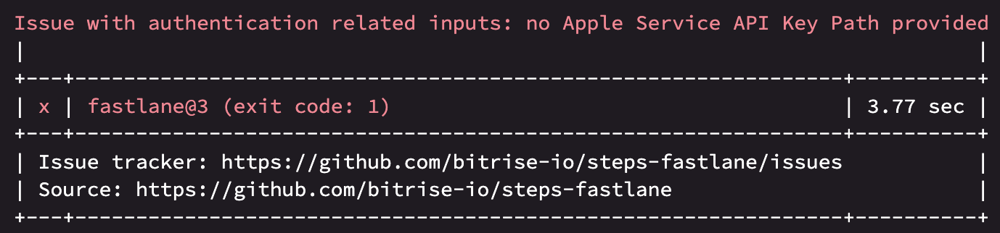
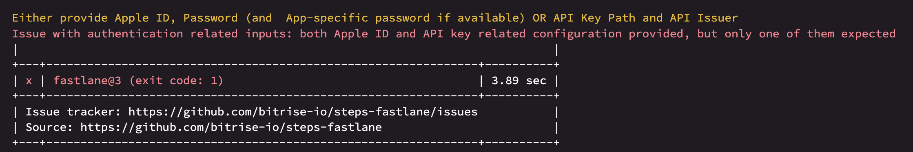
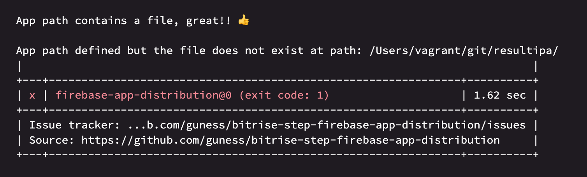
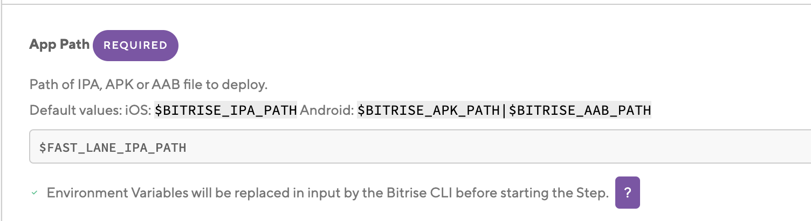

# [Setting Up Bitrise](https://devcenter.bitrise.io/en/getting-started/getting-started-with-ios-apps.html)

# Debug Bitrise build locally
- Need to install Bitrise CLI using following command:

		brew install bitrise
- To run Bitrise build:
	- Go to project and checkout desired branch in loacl pc
	- Download `bitrise.yml` file from Bitrise app's workflow page and paste it inside the repository
	- Run following command to:
	
			bitrise run WORK_FLOW_NAME

- If error occurs like this: `You don't have write permissions for the /Library/Ruby/Gems/2.3.0 directory.` check [here](https://stackoverflow.com/a/53949737/4245112).
- [Use repository's yml file instead of bitrise's given one](https://www.youtube.com/watch?v=cpdoJ7wjiJY&list=PLbKJc0NMPDrBwlTzcBYbwJZDKIwyYRODG&index=5)


# [Add Fastlane in Bitrise](https://support.bitrise.io/hc/en-us/articles/4413047188625)

# Bitrise Deploy to Firebase App Distribution

## Docs
- [Firebase doc for distributing app to testers](https://firebase.google.com/docs/app-distribution/set-up-alerts?authuser=0&platform=ios)
- [Setting up Firebase CLI](https://firebase.google.com/docs/cli#install-cli-mac-linux)
- [Setup code signing in birise](https://devcenter.bitrise.io/en/code-signing/ios-code-signing.html)

## Steps

### Manage Firebase

- Register app to app store connect
- Register app to firebase using `Bundle id`, `App store id(optional)` from app store connect app info page
- Download `GoogleServiceInfo.plist` and add to project
- Enable `Firebase App Testers API` for the app from `Google Cloud Console`
- Add `FirebaseAppDistribution` in Pod
- Add code in your app delegate to configure firebase
- Add code to check app update before installing for test
- Install firebase CLI
- Run `firebase login:ci` to generate firebase token or we can use `GOOGLE_APPLICATION_CREDENTIALS`(check below)
- Add the token to the `Bitrise -> Workflow -> Secret`
- Get your Firebase App ID from your project's General Settings page and pass this value as an input variable to the [BETA] Firebase App Distribution Step.

### Manage Bitrise workflow

To distribute `ipa` from `bitrise` through `firebase` we need to generate `ipa` by `archiving` our app. To do this we need to install certificate and profile in bitrise. To do this we will use `Fastlane Match for type Adhoc by using a Match Repository`. We will follow below steps:

- As we need to access match repository for fastlane match, we need to enable [ssh](https://www.bitrise.io/integrations/steps/activate-ssh-key) (for private bitrise workflow) or use [netrc step](https://github.com/bitrise-steplib/steps-authenticate-host-with-netrc) (for public bitrise workflow) for authenticating github.
	- Example of netrc step:

	- Use `Bitrise Secrets` for these input variables

- Add `repository clone` and `Pod install` step in workflow
- Add `fastlane match` step for type `adhoc`, use `Bitrise Secrets` for the input variables
- Add a `fastlane lane` in your projeccts `Fastfile` to generate `ipa`:
	- Example [PR](https://github.com/nimblehq/ci-cd-sample-ios/pull/24/files) is here
```
default_platform(:ios)

platform :ios do
  desc "Generate IPA"
  lane :build_and_generate_ipa do
    build_app(
      workspace: "Your_Wrokspace_Name",
      scheme: "Scheme_Name",
      export_method: "ad-hoc",
      output_directory: "Directory_Name"
    )
  end
end

```
- Add [fastlane](https://github.com/bitrise-io/steps-fastlane) step in bitrise, provide lane name from `Fastfile` that will generate ipa and provide other inputs

- Add [Firebase App Distribution](https://github.com/guness/bitrise-step-firebase-app-distribution) setp in bitrise workflow, provides input variables


```
Use Bitrise secrets for sensitive info

```

# Bitrise Troubleshooting

## Fastlane step
### Error: Apple Account Connection problem
- Type 1



- Type 2




### Solution
Need to fix inputs in `Fastlane` step related to apple authentication 
- Set `Bitrise Apple Developer Connection's` value `automatic`


		automatic: Use any enabled Apple Developer connection, either based on Apple ID authentication or API key authentication. Step inputs are only used as a fallback. API key authentication has priority over Apple ID authentication in both cases.

- Leave these two inputs `API Key: Issuer ID` and `API Key: URL` empty
- Provide `Apple ID: Email`, `Apple ID: Password` and `Apple ID: Application-specific password` through secret variable (these 3 inputs only used if authentication failed by `Apple Developer Connection with API key`)
- [Follow this link to provide Apple Developer Connection with API key in Bitrise](https://devcenter.bitrise.io/en/accounts/connecting-to-services/connecting-to-an-apple-service-with-api-key.html)
## Firebase App Distribution step

### Error: ipa file not found in Firebase App Distribution step 



- Example log:

		deploy failed, error: failed to create file artifact, error: failed to get file size, error: file not exist at: YOUR_GIVEN_PATH

### Probable cause
- IPA path is not correct

### Solution



- You need to check the `output_directory:` parameter's value in your fastfile's generate ipa lane. Let's say :  `output_directory: "./GeneratedIpa"`
- Check the generated ipa name by runnig the fastlane lane locally. 
- In your `Firebase App Distribution` step's input `App Path` should contain full path of generated ipa file. For above case the input value will be `./GeneratedIpa/IpaName.ipa`.


### GOOGLE_APPLICATION_CREDENTIALS
- For authenticating firebase for using in Github actions or Bitrise we can follow these instructions from [here](https://firebase.google.com/docs/admin/setup):
```
To generate a private key file for your service account:

In the Firebase console, open Settings > Service Accounts.

Click Generate New Private Key, then confirm by clicking Generate Key.

Securely store the JSON file containing the key.
```


- After getting the json file we can convert its content to base64 using openssl:

`openssl base64 -in <infile> -out <outfile>`

- Then we can add this base64 string to Github Actions or Bitrise secret variable and use it to authenticate. Here is an example of Github Actions workflow:


```
    - name: Set Up Google Service Account
      id: firebase_service_account
      uses: timheuer/base64-to-file@v1.2
      with:
        fileName: 'firebase_service_account.json'
        encodedString: ${{ secrets.FIREBASE_GOOGLE_APPLICATION_CREDENTIALS_BASE64 }}


```
- Use output of this step when uploading ipa to firebase

```
    - name: Build App and Distribute to Firebase
      run: bundle exec fastlane buildStagingAndUploadToFirebase
      env:
        GOOGLE_APPLICATION_CREDENTIALS: ${{ steps.firebase_service_account.outputs.filePath }}


```