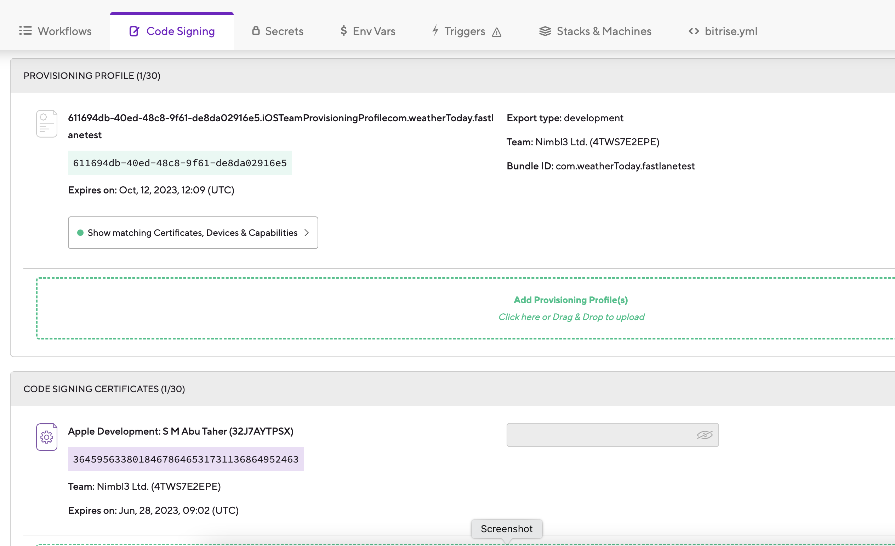
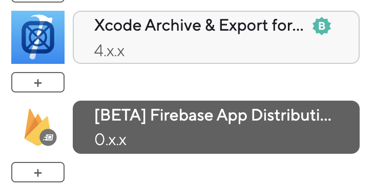

# [Setting Up Bitrise](https://devcenter.bitrise.io/en/getting-started/getting-started-with-ios-apps.html)

# Debug Bitrise build locally
- Need to install Bitrise CLI using following command:

		brew install bitrise
- To run Bitrise build:
	- Go to project and checkout desired branch in loacl pc
	- Download `bitrise.yml` file from Bitrise app's workflow page and paste it inside the repository
	- Run following command to:
	
			bitrise run WORK_FLOW_NAME

- If error occurs like this: `You don't have write permissions for the /Library/Ruby/Gems/2.3.0 directory.` check [here](https://stackoverflow.com/a/53949737/4245112).
- [Use repository's yml file instead of bitrise's given one](https://www.youtube.com/watch?v=cpdoJ7wjiJY&list=PLbKJc0NMPDrBwlTzcBYbwJZDKIwyYRODG&index=5)

# Add Danger locally
- Follow this [link](https://blog.bitrise.io/post/danger-danger-uh-that-is-using-danger-with-bitrise) to install and run Danger
- Make sure you run below command in your project folder to setup `Danger` loally. It will create `Danger` file in the folder.

		bundle exec danger init
- To run `Danger CI` locally first we need to add `DANGER_GITHUB_API_TOKEN` in out Envirnment variable using the below command:

		export DANGER_GITHUB_API_TOKEN=GENERATED_API_KEY_FROM_GITHUB
- To run `Danger CI` locally run below command, it will print warnins, failurs in your console:

		bundle exec danger pr LINK_OF_YOUR_PR

# Add Danger in Bitrise
# [Add Fastlane in Bitrise](https://support.bitrise.io/hc/en-us/articles/4413047188625)

# [Bitrise Deploy to Firebase App Distribution](https://devcenter.bitrise.io/en/steps-and-workflows/workflow-recipes-for-ios-apps/-ios--deploy-to-firebase-app-distribution.html)

## Docs
- [Firebase doc for distributing app to testers](https://firebase.google.com/docs/app-distribution/set-up-alerts?authuser=0&platform=ios)
- [Setting up Firebase CLI](https://firebase.google.com/docs/cli#install-cli-mac-linux)
- [Setup code signing in birise](https://devcenter.bitrise.io/en/code-signing/ios-code-signing.html)

## Steps

- Register app to app store connect
- Register app to firebase using `Bundle id`, `App store id` from app store connect app info page
- Download `GoogleServiceInfo.plist` and add to project
- Enable `Firebase App Testers API` for the app from `Google Cloud Console`
- Add `FirebaseAppDistribution` in Pod
- Add code in your app delegate to configure firebase
- Add code to check app update before installing for test
- Install firebase CLI
- Run `firebase login:ci` to generate firebase token
- Add the token to the `Bitrise -> Workflow -> Secret`
- Get your Firebase App ID from your project's General Settings page and pass this value as an input variable to the [BETA] Firebase App Distribution Step.
- [Follow below steps for code signing](https://devcenter.bitrise.io/en/code-signing/ios-code-signing/managing-ios-code-signing-files---automatic-provisioning.html):

### iOS code signing with automatic provisioning
#### code signing with [codesigndoc](https://devcenter.bitrise.io/en/code-signing/ios-code-signing/collecting-and-exporting-code-signing-files-with-codesigndoc.html#collecting-and-uploading-the-files-with-codesigndoc)

- Run below command from terminal from the same location of your `.xcodeproj` or `.xcworkspace` :

		bash -l -c "$(curl -sfL https://raw.githubusercontent.com/bitrise-io/codesigndoc/master/_scripts/install_wrap-xcode.sh)"  

- Now follow your terminal and this [document](https://devcenter.bitrise.io/en/code-signing/ios-code-signing/collecting-and-exporting-code-signing-files-with-codesigndoc.html#collecting-and-uploading-the-files-with-codesigndoc)

- After completing all the steps, go to `Code Signing` tab in your `Bitrise` workflow, you will find the necessary files are uploaded:

- Now add `Xcode Archive & Export for iOS` and `[BETA] Firebase App Distribution` in Bitrise workflow

- Need to provide value of input variables for `Xcode Archive & Export for iOS`
- Follow this [document](https://devcenter.bitrise.io/en/accounts/connecting-to-services/connecting-to-an-apple-service-with-apple-id.html) to connect with `Apple Acccount`

