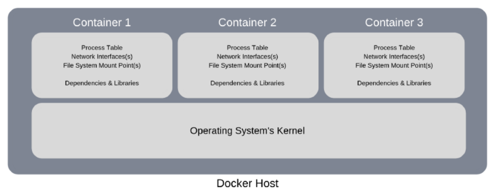

# Docker
In simple terms, Docker is a software platform that simplifies the process of **building**, **running**, **managing** and **distributing** applications. It does this by virtualizing the operating system of the computer on which it is installed and running.

## Docker Host
The machine on which Docker is installed and running is usually referred to as a **Docker Host or Host** in simple terms.

## Docker Container
- A Docker container image is a lightweight, standalone, executable package of software that includes everything needed to run an application: code, runtime, system tools, system libraries and settings.

- A Docker Container doesn’t have any operating system installed and running on it. But it would have a virtual copy of the process table, network interface(s), and the file system mount point(s). These have been inherited from the operating system of the host on which the container is hosted and running. Whereas the kernel of the host’s operating system is shared across all the containers that are running on it. This allows each container to be isolated from the other present on the same host. Thus it supports multiple containers with different application requirements and dependencies to run on the same host, as long as they have the same operating system requirements.

- A container is a running unit of an image. From one image we can create one or more containers. Every one of them will run in their own isolation zone and they will share host system if they extend the same operating systems or same layer.

## Docker Image
A Docker image is a file used to execute code in a Docker container. Docker images act as a set of instructions to build a Docker container, like a template. Docker images also act as the starting point when using Docker. An image is comparable to a snapshot in virtual machine (VM) environments. Images have layers. For example, extending an Ubuntu OS and putting a file in there will make a layer. You can run any number of containers from it. They all will have the file and they will share the Ubuntu OS.
Images consist of:
- Code
- Runtime
- Libraries
- Configurations

## Docker container vs. Docker image
A Docker container is a virtualized runtime environment used in application development. It is used to create, run and deploy applications that are isolated from the underlying hardware. A Docker container can use one machine, share its kernel and virtualize the OS to run more isolated processes. As a result, Docker containers are lightweight.

A Docker image is like a snapshot in other types of VM environments. It is a record of a Docker container at a specific point in time. Docker images are also immutable. While they can't be changed, they can be duplicated, shared or deleted. The feature is useful for testing new software or configurations because whatever happens, the image remains unchanged.

Containers need a runnable image to exist. Containers are dependent on images, because they are used to construct runtime environments and are needed to run an application.

## Advantages of using Docker

- Docker supports multiple applications with different application requirements and dependencies, to be hosted together on the same host, as long as they have the same operating system requirements.

- Storage Optimized. A large number of applications can be hosted on the same host, as containers are usually few megabytes in size and consume very little disk space.

- Robustness. A container does not have an operating system installed on it. Thus, it consumes very little memory in comparison to a virtual machine (which would have a complete operating system installed and running on it). This also reduces the bootup time to just a few seconds, as compared to a couple of minutes required to boot up a virtual machine.

- Reduces costs. Docker is less demanding when it comes to the hardware required to run it.

## Disadvantages of using Docker

- Applications with different operating system requirements cannot be hosted together on the same Docker Host. For example, let’s say we have 4 different applications, out of which 3 applications require a Linux-based operating system and the other application requires a Windows-based operating system. In such a scenario, the 3 applications that require Linux-based operating system can be hosted on a single Docker Host, whereas the application that requires a Windows-based operating system needs to be hosted on a different Docker Host.

## commands

- ***docker ps***
    - show all containes
- ***docker image ls***
    - show all docker image
- ***docker stop CONTAINER_HASH***
    - stop a running container
- ***docker image rm -f IMAGE_HASH***
    - stop a running container

