# Jenkins
Jenkins is a open source continuous integration server. It builds and tests your software continuously and monitors the execution and status of remote jobs, making it easier for team members and users to regularly obtain the latest stable code and deploy to pre-prod or prod.

## Jenkins Pipeline

Jenkins Pipeline is a set of plugins for Jenkins to define CI/CD flows. Jenkins Pipeline definition can be written into a file named `Jenkinsfile` or put into Jenkins configurations.
There are `two types` of Pipeline definitions. `Declarative` and `scripted`.

## Installing and Running Jenkins with Docker

#### why Jenkins with Docker
To install Jenkins, we used Docker containers. Our master Jenkins server sits inside the container and connects our build machine with SSH. The reason we choose this structure is the portability.

When we use docker container, we give local volume to Jenkins. It is writing all of its data into this folder and it is synced with the folder in our build machine. This ensures that, when we shut the container down, we have all the Jenkins data like settings, project configurations, logs etc. A new Jenkins container can run from that data. Jenkins will validate its data at start. It will notify changes or expired configuration entries. Hence the reason we store data in our build machine.

We can update Jenkins with just a few commands. Stop the container, pull the new image and run a new container from new image. We won’t install java, we won’t install jenkins environmental variables. Our build server is clean just with the docker installation.

This easy setup process makes it possible to, in emergency situations, create a build server inside any machine using macOS too.

### Steps to launch a mac agent

- [install docker](https://docs.docker.com/desktop/install/mac-install/)
- check if docker installed by running:
	- ***docker --version***
- check if docker can pull image:
	- ***docker run hello-world***
- pull jenkins image:
	- ***docker pull jenkins/jenkins***
- run jenkins image:
	- ***`docker run -d -v jenkins_home:/var/jenkins_home -p 8080:8080 -p 50000:50000 jenkins/jenkins`***

> With this command we are running a container with daemon mode. We are assigning a volume to “/var/jenkins_home” folder to sync Jenkins files with our host machine. We are assigning 8080 and 50000 ports of host machine to docker container. Docker will listen to these ports and forward them to container. Lastly, we are giving image tag. This command will produce an image hash like: `b69490d09bd5a661749452352c047dc4e8d0768f988c99bbd8fa2ee812b97b68` for successful allocations.

> If you have applications listening to these ports, you have to change ports or close them. Left side of the port assignment is host machine. For example, `80:8080` will forward 80 port of host machine to 8080 port of container. Now when you go to the address `http://localhost:8080` you will see the initial jenkins page like below:

- connect with container:
	- ***docker exec -it image_hash bash***

> “i” means interactive shell. If you don’t specify this, docker will send your command into container and exit when its finished.

> “t” commands docker to create pseudo terminal. Without this it will act like a terminal connection.

> Lastly bash is the program to run. You can specify other programs without -i. We will try this soon.

- get initial admin password:
	- ***cat /var/jenkins_home/secrets/initialAdminPassword***
- *if you don't find the initial page, you may get a login form. In taht case the username is `admin` and password will be the `initial admin password` from above.*
- Now login to jenkins.
- Install recommended plugins.
- Currently we are using Linux, to enable MacOS we need to enable `Remote login` from Mac's `System Preference` -> `Sharing`
- Now create a new node in jenkis for the mac pc from `Manage Jenkins` -> `Nodes` -> `New Node`

- fill all properties like the above image. If you don't find these properties, install `SSH` related plugins first.

- the `Host` is your computers local address. You can find it from here:

- at this point we will get error when launching the new node.
- now find the curent container id by running:
	- ***docker ps***
- now connect container to the host by running:
	- ***docker exec -it PREVIOUS_CONTAINER_HASH bash***
	- ***ssh username@docker.for.mac.localhost***
	- ***ssh -o StrictHostKeyChecking=no username@docker.for.mac.localhost***

- now launch the node 

> :warning: **If you face any error like Java not found or Java version not found, please install install exact same version of java that is installed in jenkins. If the version not matched you will find more errors.**

- Make your `ssh based plugins` in jenkins like below picture:

- Now try to relaunch the agent. You may find error like this:

- Now run below command following the error:

		curl -sO http://localhost:8080/jnlpJars/agent.jar java -jar agent.jar -jnlpUrl http://localhost:8080/manage/computer/mac/jenkins-agent.jnlp -secret 0f13e879ddb87c78e9ebacb7153f63af1d596ec491dcd6596022c113623de4b6

- Agent should launch successfully now

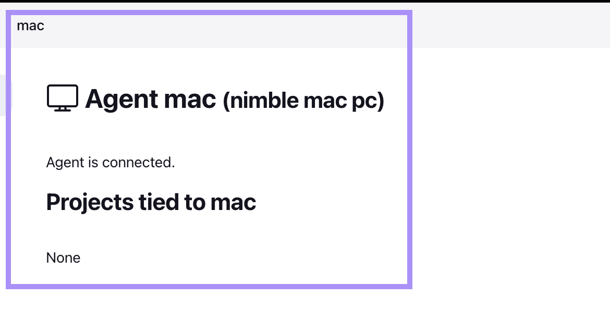

> :warning: **Always use same container HASH**

## Creating Jenkins job

### FreeStyle Project with Git Hook
- this time we will create a jenkins job that can be satrted to trigger iOS Project build and test from github events like commit, pr etc and can be started maually also
- click to `new item` on the jenkins home page and select `FreeStyle Project`
- then create and configure like below images:
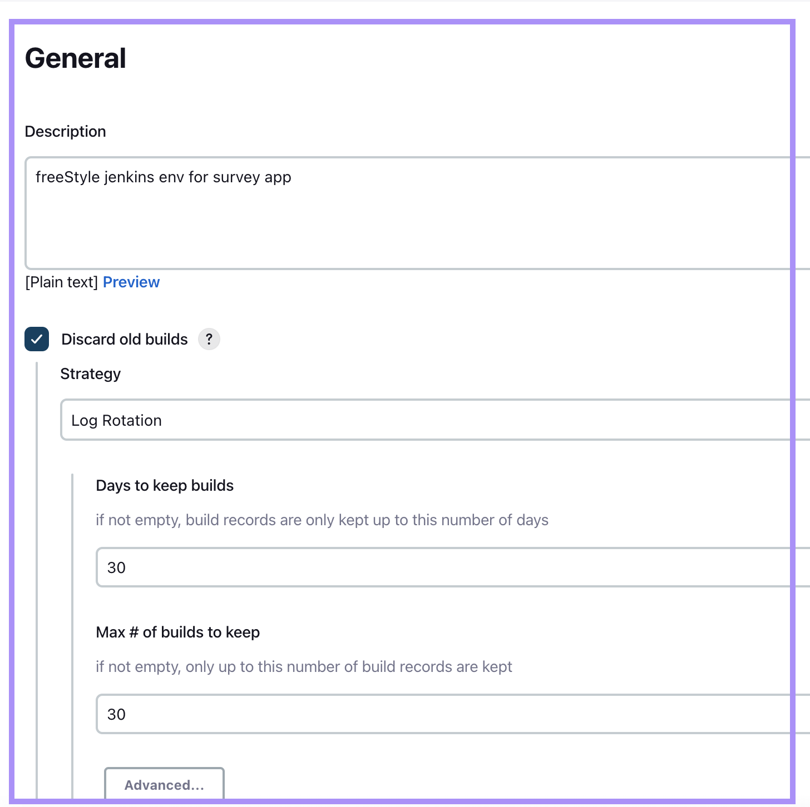

- `Restrict where this project can be run` will ensure the `mac node` that we created before will be used to run the build and test job

- provide your github credentials

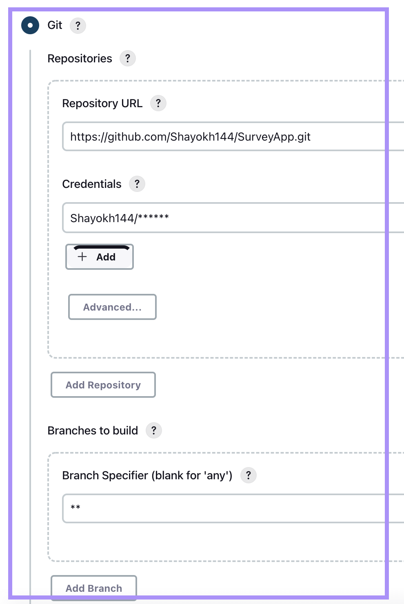

- `GitHub hook trigger for GITScm polling` this plugin is used for making the github webhook work
- don't select `Trigger builds remotely (e.g., from scripts)` for now

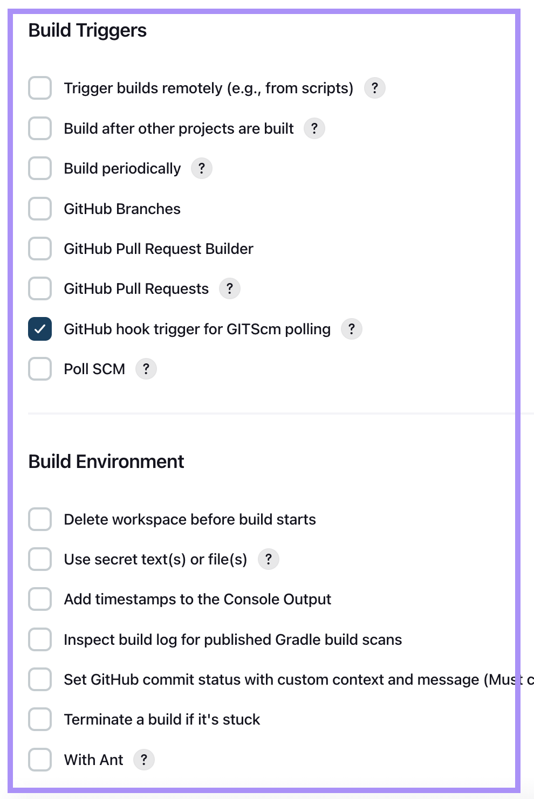

- add build and test commands

		xcrun xcodebuild -workspace SurveyApp.xcworkspace -scheme SurveyApp -sdk iphoneos CODE_SIGN_IDENTITY="" CODE_SIGNING_REQUIRED=NO

		xcrun xcodebuild -workspace SurveyApp.xcworkspace -scheme SurveyAppTests -sdk iphonesimulator -destination 'platform=iOS Simulator,name=iPhone 13,OS=15.5' -derivedDataPath '.output' test

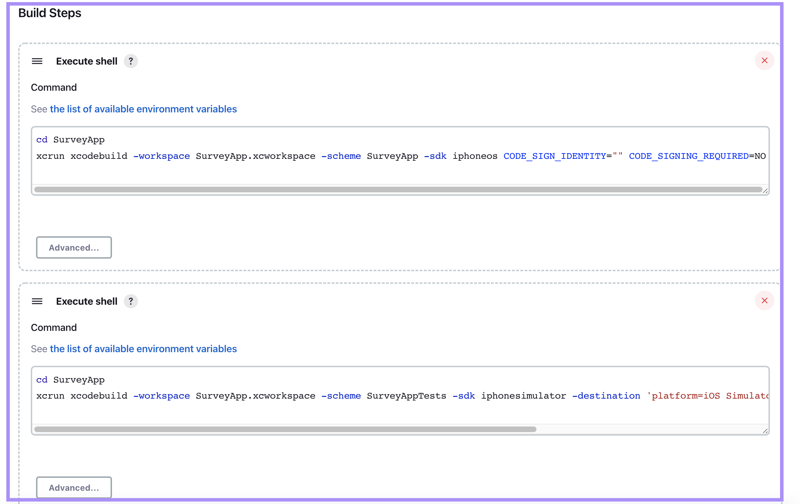

- Now `Save` and go to dashboard. you can start a build manually by clicking `Buils Now`

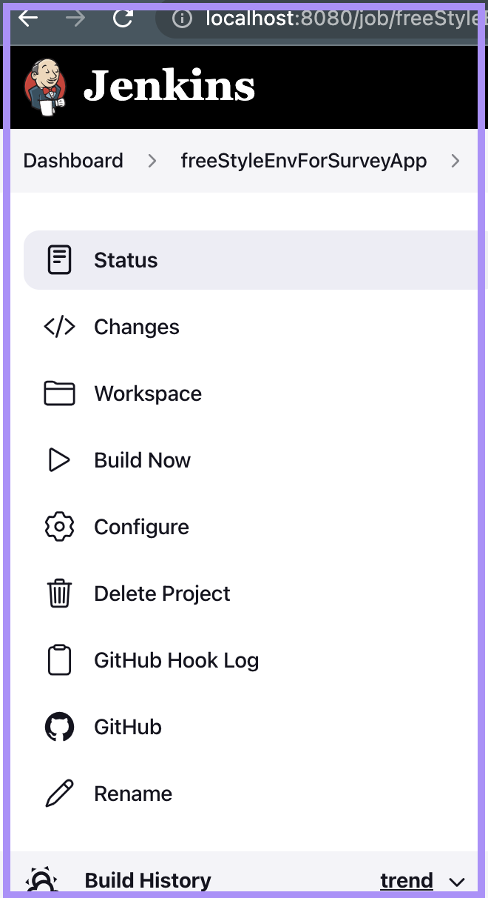

- Manual build output will look like below:

- Now for get events from github we need this local jenkins surver accessible from internet. To make it public we will use `ngrok`.

- Install `ngork` using following command from terminal:
	-  ***brew install ngrok/ngrok/ngrok***
- From terminal run and you will see new url like below image:
	- ***ngrok http 8080***

- Now create a webhook using that url in your github repository:

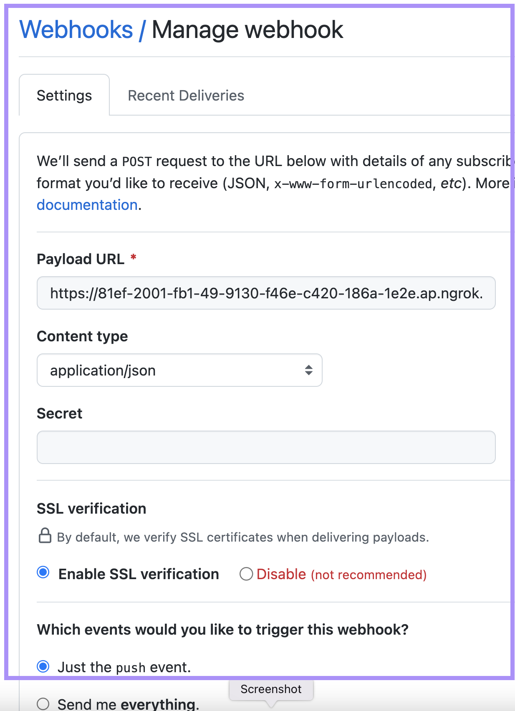

- Now push a commit to the repo and your jenkins node will trigger the free style job like below:

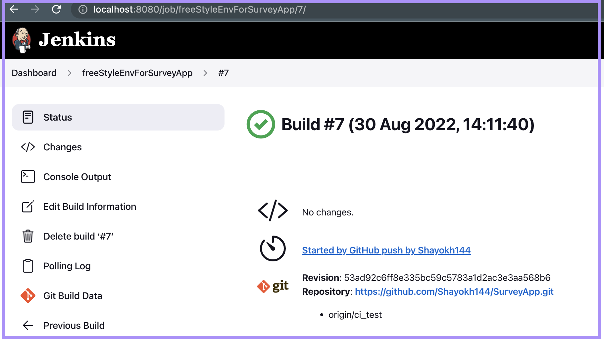

### Multibranch Pipeline

- click to `new item` on the jenkins home page and select `Multibranch Pipeline`
- then create and configure like below images:

**Build Sourcces**

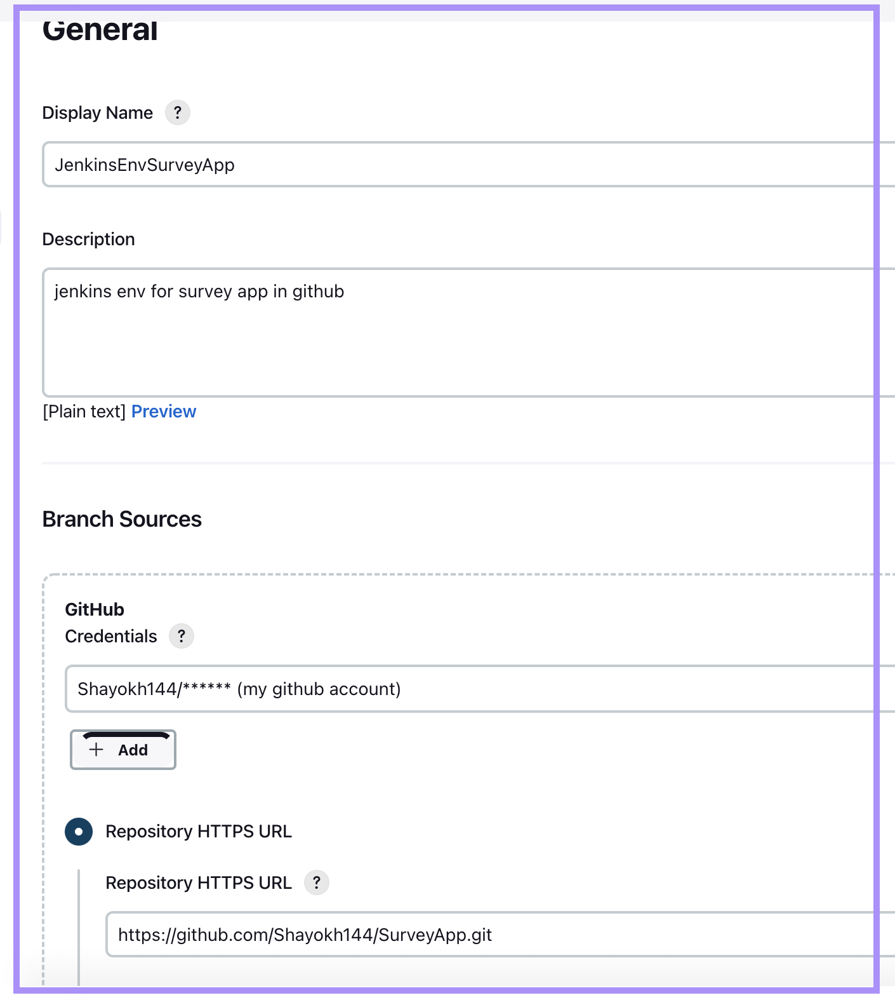

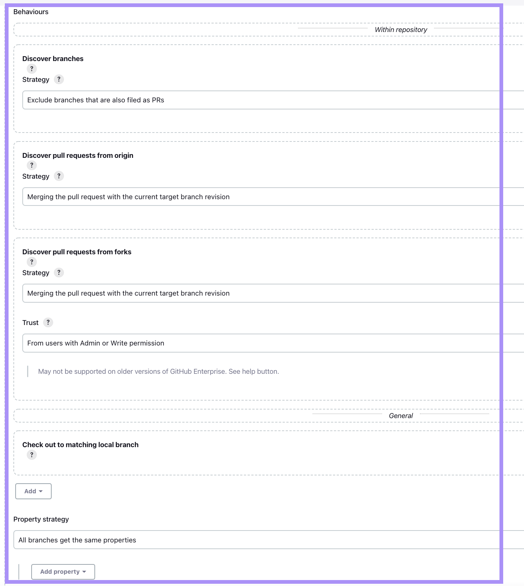

**Build Configuration**
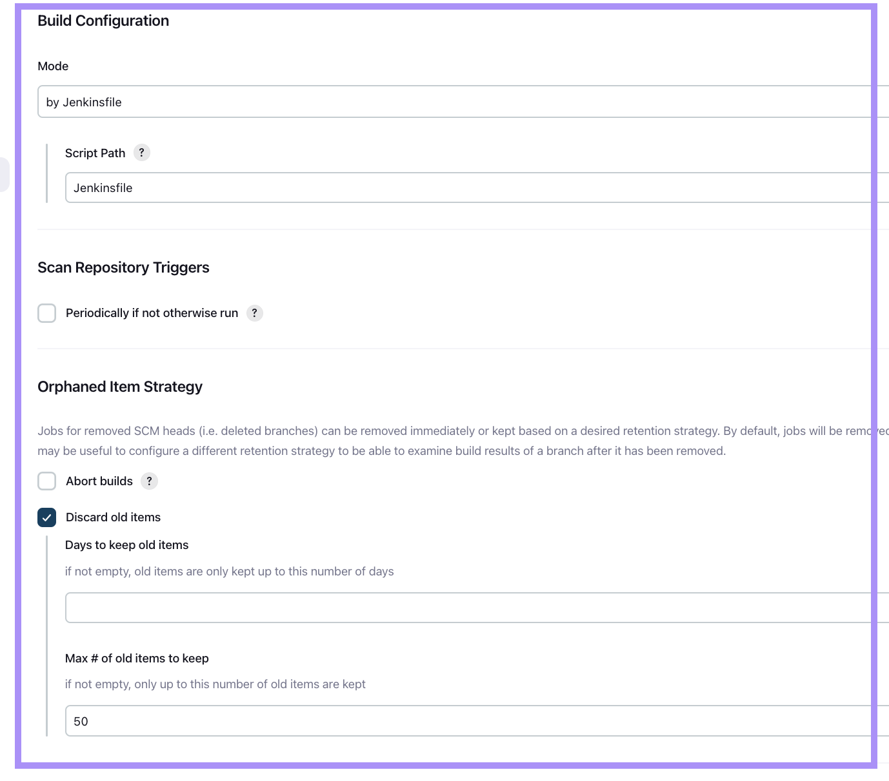

https://localhost:8080/github-webhook/

### Resources

- [jenkins+docker+android](https://medium.com/@carlitosdroid/dockerized-jenkins-for-mobile-ci-cd-part-2-7725f80006b)
- [jenkins+docker+iOS](https://medium.com/multinetinventiv/ci-cd-with-jenkins-docker-and-fastlane-p2-jenkins-and-docker-45960d1958fd)