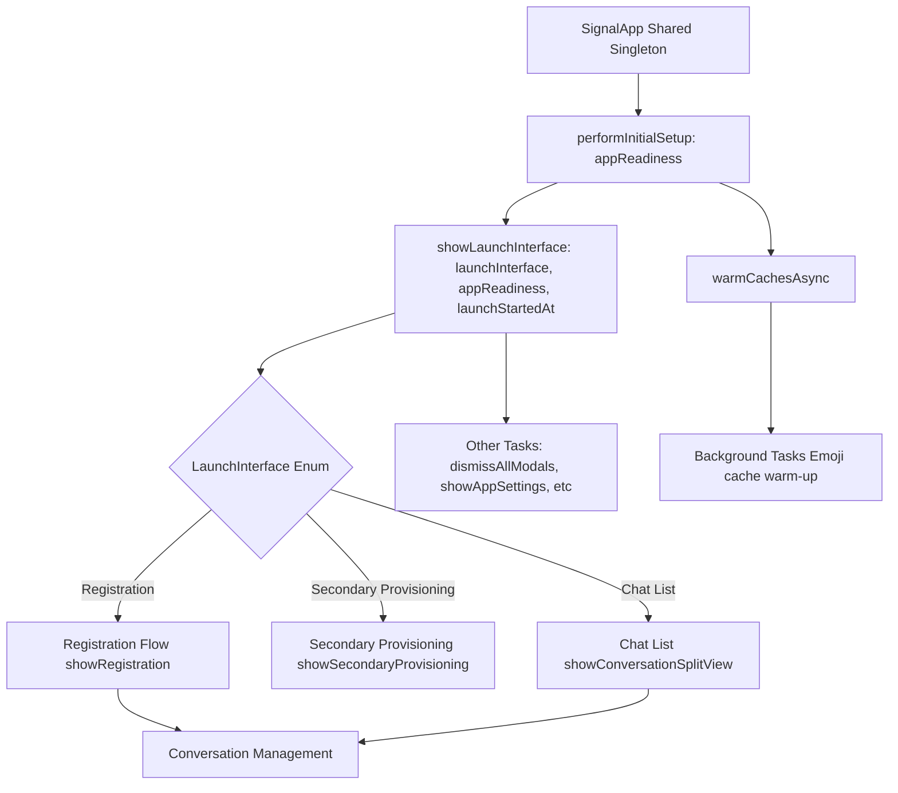
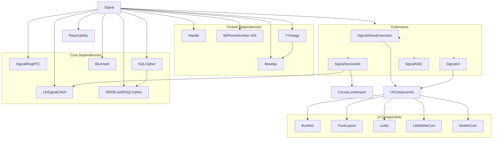
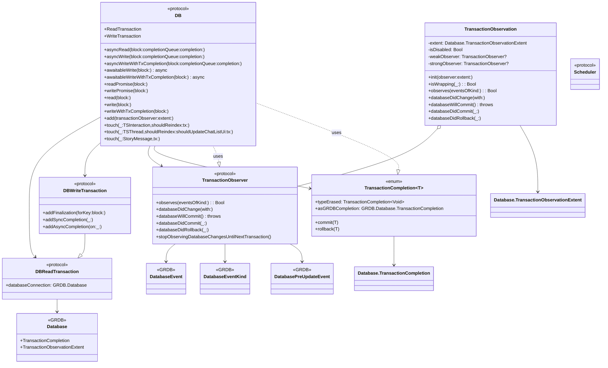
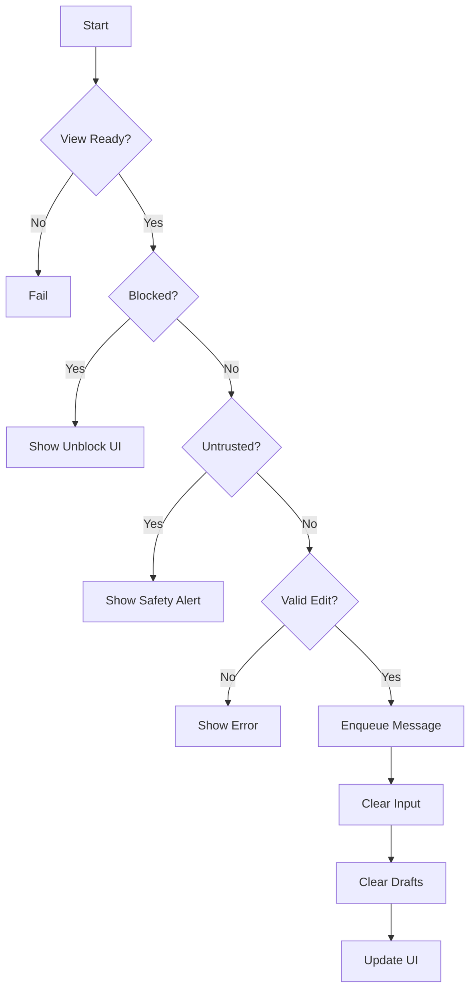
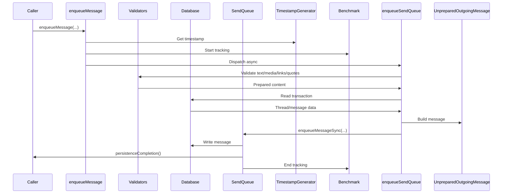
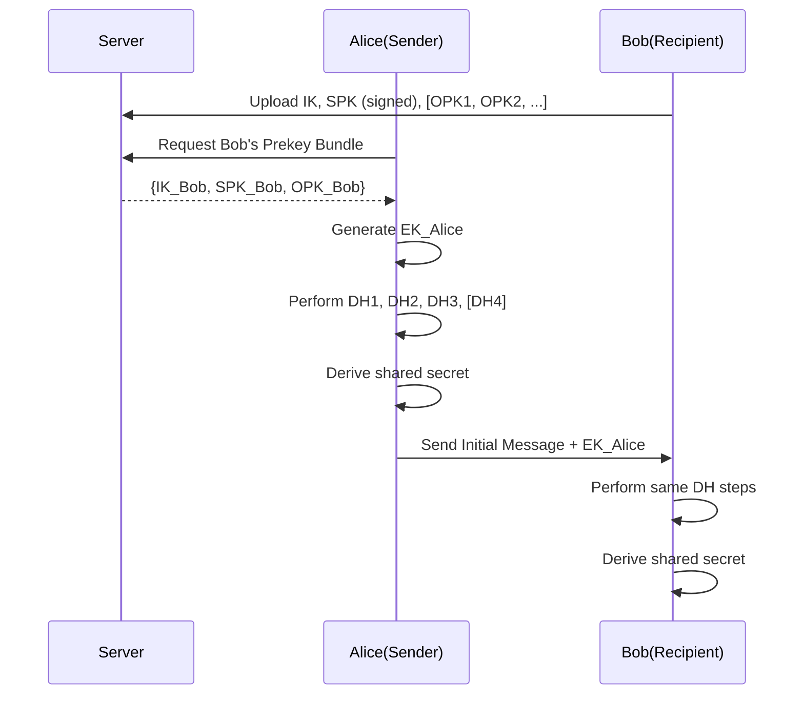
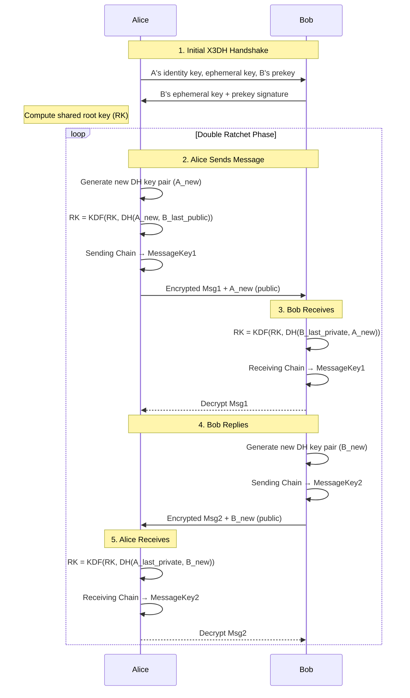

# Signal-iOS


## Introduction
[Signal](https://github.com/signalapp/Signal-iOS/tree/main) is a free, open source, messaging app for simple private communication with friends.


## Requirements

- Xcode 15 or highier
- iOS 15 or highier

## Installation

- Signal makes use of sub-modules, we must use git clone:

`git clone --recurse-submodules https://github.com/signalapp/Signal-iOS`

- Mode to the `Signal-iOS` folder and run:

`make dependencies`
- While running above command, you might face error like this:
`'urllib.error.URLError: <urlopen error [SSL: CERTIFICATE_VERIFY_FAILED]` . To solve it you need to follow [this answer](https://stackoverflow.com/a/70495761/4245112).


- Open the `Signal.xcworkspace` in Xcode.
- You can run `Signal` or `Signal-Staging` in the simulator.

## Application Architecture

### Folder Structure
- From the folder structure, we can see that the Signal iOS app is organized based on features and functionalities. Each folder corresponds either to a user-facing feature, such as the registration process, or to internal functionalities, like managing app launch operations. A detailed folder structure is provided below.

- Inside each feature folder, we find feature-related logic classes alongside a `UserInterface` subfolder, which contains all the views (Views) and controllers (ViewControllers).

- For example, let’s examine the Registration folder:
	- The Registration folder contains code for user onboarding, phone number verification, and account creation in Signal. It includes logic for validating phone numbers, managing registration states, and handling UI screens for the registration process.
	- Files like `RegistrationCoordinator.swift, RegistrationCoordinatorImpl.swift, RegistrationCoordinatorImpl+Service.swift, and RegistrationCoordinatorLoader.swift` contain navigation logic and manage the overall registration flow.
	- A file like PhoneNumberValidator.swift contains validation logic for phone numbers.
	- The UserInterface subfolder contains all view-related files.
	- There are specific view controller classes, such as `RegistrationRestoreFromBackupViewController.swift` `RegistrationChangePhoneNumberViewController.swift`, `RegistrationVerificationViewController.swift`, which handle UI interactions for functionalities like changing a phone number during registration, restoring an account from a backup or processing registration verification code.
	- ViewControllers most of the time contains a `State struct` that holds the state of the view and a `protocol Presenter`, that contains presentation logic. For example in the file `RegistrationVerificationViewController.swift` you will find `RegistrationVerificationPresenter` and `RegistrationVerificationState`.

```
├── AppLaunch
│   ├── AppDelegate.swift
│   ├── AppEnvironment.swift
│   ├── LaunchJobs.swift
│   ├── LoadingViewController.swift
│   ├── MainAppContext.swift
│   └── SignalApp.swift
├── Registration
│   ├── PhoneNumberValidator.swift
│   ├── RegistrationCoodinatorShims.swift
│   ├── RegistrationCoordinator.swift
│   ├── RegistrationCoordinatorDependencies.swift
│   ├── RegistrationCoordinatorImpl+Service.swift
│   ├── RegistrationCoordinatorImpl.swift
│   ├── RegistrationCoordinatorLoader.swift
│   ├── RegistrationMode.swift
│   ├── RegistrationStep.swift
│   ├── RegistrationUtils.swift
│   └── UserInterface
│       ├── RegistrationCaptchaViewController.swift
│       ├── RegistrationChangeNumberSplashViewController.swift
│       ├── RegistrationChangePhoneNumberConfirmationViewController.swift
│       ├── RegistrationChangePhoneNumberViewController.swift
│       ├── RegistrationConfirmModeSwitchViewController.swift
│       ├── RegistrationEnterBackupKeyViewController.swift
│       ├── RegistrationLoadingViewController.swift
│       ├── RegistrationNavigationController.swift
│       ├── RegistrationPermissionsView.swift
```
- Details of folder structure is [HERE](signal_res/signal_folder_structure.txt)


### App Architecture


- In this Diagram `Request` means request for Data, Service or UI and `Response` may contain Data, Service or UI.

#### Presentation layer
- Presentation layer contains Views and business logics. Views contains ViewControllers, UIViews, SwiftUI views. This layer also contains Presenters, ViewModels, Coordinators.
- This module mostly follows Model-View-Presenter (MVP) architecture, for example: `RegistrationVerificationViewController` acted as a `View` and there are `RegistrationVerificationPresenter` played as `Presenter` while `RegistrationVerificationState` and  `RegistrationVerificationValidationError` acted as `Model`.
- Delegation(Protocol-Delegate) is used to maintain communication among the components. For example:
	- `RegistrationVerificationViewController` contains presenter as a weak variable.

`private weak var presenter: RegistrationVerificationPresenter?`

	
- Functionalities of `RegistrationVerificationPresenter` is implemented inside `RegistrationNavigationController` which also initiates the `RegistrationVerificationViewController` with state and presenter.
- `RegistrationNavigationController` also contains coordintor through protocol `RegistrationCoordinator` and maintain navigation flow for registration. Implementation of `RegistrationCoordinator` is done in `RegistrationCoordinatorImpl`.

- A demo class diagram with minimal code:


#### Singleton Instance: SignalApp

The SignalApp class is a central orchestrator in the Signal iOS app, managing app initialization, navigation, and high-level state transitions. It follows best practices like the singleton pattern, dependency injection, and modular design to ensure a clean and maintainable architecture. Its responsibilities range from handling app launch to managing conversations and resetting app data, making it a critical component of the Signal app. The class is designed to serve as a bridge between the app’s core services (like the database and caching systems) and the UI. Though it is a Singleton class still it is using Dependency Injection through methods like `performInitialSetup(appReadiness:)` It encapsulates:

- Navigation and view management (launching the appropriate view controller based on user state).
- Background preparation (warming caches and setting up UI readiness).
- Maintenance tasks (resetting data, database integrity checks, exporting data)

#### Class Diagram of SignalApp.shared

```mermaid
classDiagram
    class SignalApp {
        +shared: SignalApp
        -conversationSplitViewController: ConversationSplitViewController?
        +performInitialSetup(appReadiness: AppReadiness)
        -warmCachesAsync()
        +showLaunchInterface(_: LaunchInterface, appReadiness: AppReadinessSetter, launchStartedAt: TimeInterval)
        +showConversationSplitView(appReadiness: AppReadinessSetter)
        +dismissAllModals(animated: Bool, completion: (() -> Void)?)
        +showRegistration(loader: RegistrationCoordinatorLoader, desiredMode: RegistrationMode, appReadiness: AppReadinessSetter)
        +spamChallenge()
        +showNewConversationView()
        +presentConversationForAddress(_: SignalServiceAddress, action: ConversationViewAction, animated: Bool)
        +presentConversationForThread(_: TSThread, action: ConversationViewAction, focusMessageId: String?, animated: Bool)
        +showMyStories(animated: Bool)
        +snapshotSplitViewController(afterScreenUpdates: Bool) -> UIView?
        +resetAppDataWithUI(keyFetcher: GRDBKeyFetcher)
        +resetLinkedAppDataWithUI(currentDeviceId: Int, keyFetcher: GRDBKeyFetcher)
        +resetAppDataAndExit(keyFetcher: GRDBKeyFetcher) -> Never
        +resetAppData(keyFetcher: GRDBKeyFetcher)
        +showTransferCompleteAndExit()
        +showSecondaryProvisioning(appReadiness: AppReadinessSetter)
        +showExportDatabaseUI(from: UIViewController, completion: () -> Void)
        +showDatabaseIntegrityCheckUI(from: UIViewController, databaseStorage: SDSDatabaseStorage, completion: () -> Void)
    }

    class LaunchInterface {
        <<enumeration>>
        +registration(RegistrationCoordinatorLoader, RegistrationMode)
        +secondaryProvisioning
        +chatList
    }

    class RegistrationCoordinatorLoader {
        +coordinator(forDesiredMode: RegistrationMode, transaction: DBWriteTransaction) -> RegistrationCoordinator
    }

    class RegistrationCoordinator {
        +start()
    }

    class ConversationSplitViewController {
        +selectedThread: TSThread?
        +selectedConversationViewController: ConversationViewController?
        +presentThread(_: TSThread, action: ConversationViewAction, focusMessageId: String?, animated: Bool)
        +showNewConversationView()
        +showMyStoriesController(animated: Bool)
    }

    class AppReadiness {
        +runNowOrWhenUIDidBecomeReadySync(_: () -> Void)
    }

    class AppReadinessSetter {
        +setUIIsReady()
    }

    class SSKEnvironment {
        +shared: SSKEnvironment
        +preferencesRef: Preferences
        +databaseStorageRef: SDSDatabaseStorage
        +notificationPresenterRef: NotificationPresenter
    }

    class SpamCaptchaViewController {
        +presentActionSheet(from: UIViewController)
    }

    class TSThread {
        +uniqueId: String
    }

    class SignalServiceAddress {
        +stringValue: String
    }

    class OWSFileSystem {
        +deleteContents(ofDirectory: String)
    }

    class DebugLogger {
        +wipeLogsAlways(appContext: AppContext)
    }

    SignalApp --> LaunchInterface : Determines launch interface
    SignalApp --> ConversationSplitViewController : Manages main chat interface
    SignalApp --> RegistrationCoordinatorLoader : Creates registration coordinator
    SignalApp --> RegistrationCoordinator : Handles registration flow
    SignalApp --> AppReadiness : Waits for app readiness
    SignalApp --> AppReadinessSetter : Sets UI readiness
    SignalApp --> SSKEnvironment : Accesses shared environment
    SignalApp --> SpamCaptchaViewController : Handles spam challenges
    SignalApp --> TSThread : Manages conversation threads
    SignalApp --> SignalServiceAddress : Represents user addresses
    SignalApp --> OWSFileSystem : Handles file system cleanup
    SignalApp --> DebugLogger : Manages debug logs

    ConversationSplitViewController --> TSThread : Displays selected thread
    RegistrationCoordinatorLoader --> RegistrationCoordinator : Creates coordinator
    SSKEnvironment --> SDSDatabaseStorage : Manages database
    SSKEnvironment --> Preferences : Manages app preferences
    SSKEnvironment --> NotificationPresenter : Manages notifications
```



##### Components
- SignalApp: The central singleton class that manages app-wide behavior. Interacts with other components like ConversationSplitViewController, RegistrationCoordinator, and SSKEnvironment.

- LaunchInterface: An enumeration that defines the possible launch states of the app (e.g., registration, chat list).

- ConversationSplitViewController: Manages the main chat interface, including displaying threads and conversations.

- RegistrationCoordinatorLoader and RegistrationCoordinator: Handle the registration flow for new or re-registering users.

- AppReadiness and AppReadinessSetter: Ensure the app is ready before performing certain actions.

- SSKEnvironment: Provides access to shared app components like the database, preferences, and notification presenter.

- SpamCaptchaViewController: Handles spam challenges by presenting a captcha to the user.

- TSThread and SignalServiceAddress: Represent chat threads and user addresses, respectively.

- OWSFileSystem and DebugLogger: Handle file system operations and debug logging.

#### Simplified Flow Diagram of SignalApp.shared




### Dependency Injection
- No 3rd party library is used to maintain dependency, it is fully managed manually. For example: in `AppDelegate` they initiate `DataBase` like this:

```
let databaseStorage: SDSDatabaseStorage
do {
    databaseStorage = try SDSDatabaseStorage(
        appReadiness: appReadiness,
        databaseFileUrl: SDSDatabaseStorage.grdbDatabaseFileUrl,
        keychainStorage: keychainStorage
    )
} catch KeychainError.notAllowed where application.applicationState == .background {
    notifyThatPhoneMustBeUnlocked()
} catch {
    // It's so corrupt that we can't even try to repair it.
    didAppLaunchFail = true
    Logger.error("Couldn't launch with broken database: \(error.grdbErrorForLogging)")
    let viewController = terminalErrorViewController()
    _ = initializeWindow(mainAppContext: mainAppContext, rootViewController: viewController)
    presentDatabaseUnrecoverablyCorruptedError(from: viewController, action: .submitDebugLogsAndCrash)
    return true
}
```


- Most of the ViewControllers having method like `public static func load()` that is used to create an instance of the ViewController from outside. For example: 
- `ConversationViewController` has a static load() method that takes some parameters and return the VC:

```
public static func load(
    appReadiness: AppReadinessSetter,
    threadViewModel: ThreadViewModel,
    action: ConversationViewAction,
    focusMessageId: String?,
    tx: SDSAnyReadTransaction
) -> ConversationViewController {
    let thread = threadViewModel.threadRecord
    
    // CODES FOR CREATING OTHER ITEMS

    let cvc = ConversationViewController(
        appReadiness: appReadiness,
        threadViewModel: threadViewModel,
        conversationViewModel: conversationViewModel,
        action: action,
        conversationStyle: conversationStyle,
        didAlreadyShowGroupCallTooltipEnoughTimes: didAlreadyShowGroupCallTooltipEnoughTimes,
        loadAroundMessageId: loadAroundMessageId,
        scrollToMessageId: scrollToMessageId,
        oldestUnreadMessage: oldestUnreadMessage,
        chatColor: chatColor,
        wallpaperViewBuilder: wallpaperViewBuilder
    )

    return cvc
}


```

- This loader is called from another class like this:
```
func createPreviewController(atIndexPath indexPath: IndexPath) -> UIViewController? {
    guard let threadViewModel = tableDataSource.threadViewModel(forIndexPath: indexPath) else {
        owsFailDebug("Missing threadViewModel.")
        return nil
    }
    let vc = SSKEnvironment.shared.databaseStorageRef.read { tx in
        ConversationViewController.load(
            appReadiness: appReadiness,
            threadViewModel: threadViewModel,
            action: .none,
            focusMessageId: nil,
            tx: tx
        )
    }
    vc.previewSetup()
    return vc
}


```

### Dependency List

- For managing dependency Signal iOS is using Cocoapods.
- Most dependencies use explicit version tags (e.g., SwiftProtobuf 1.28.2)

#### Important Signal Dependencies
##### LibSignalClient
- The fundamental encryption library from Signal contains platform-agnostic APIs used by the official Signal clients and servers, exposed as a Java, Swift, or TypeScript library. It ensures that only the sender and intended recipient(s) can read messages—not even Signal’s servers can decrypt them.
- libsignal-protocol implements the Signal protocol, including the Double Ratchet algorithm. A replacement for libsignal-protocol-java and libsignal-metadata-java.
- Support logic for Signal's device-to-device transfer feature.

##### SignalRingRTC
- SignalRingRTC is a middleware library providing Signal Messenger applications with video and voice calling services built on top of WebRTC.


##### SQLCipher
- SQLCipher is an open-source extension of SQLite that adds transparent, full-database encryption
- It ensures all data written to disk is AES-256 encrypted, protecting user messages, contacts, and metadata if the device is compromised.



### Service layer

#### Data Management

- Signal iOS is using a 3rd party library named [GRDB](https://github.com/groue/GRDB.swift) which is a toolkit for SQLite databases, with a focus on application development to store data.
- They used UserDefaults too.

#### DB protocol
- The DB protocol defines an abstraction layer for database operations and transactions, providing a unified interface that mimics the behavior of the underlying storage mechanism.

- By defining a protocol that wraps transaction-based operations, the design allows high-level components to remain agnostic about how the data is persisted. Tests can replace the actual database implementation with stubs, ensuring that business logic can be validated without side effects caused by interacting with a real database.


- The protocol separates the mechanics of executing SQL queries from the higher-level model and query classes (like the “FooFinder” or models conforming to SDSCodableModel). This way, the actual query implementation is delegated to lower-level helpers, while the rest of the system relies on the abstract transaction interface.

- `SDSDB` conforms this protocol and use `SDSDatabaseStorage` to manage database related functionality.
- In `AppDelegate` inside inside `didFinishLauncWithOption`, `SDSDatabaseStorage` is created like this:

```
let databaseStorage: SDSDatabaseStorage
do {
    databaseStorage = try SDSDatabaseStorage(
        appReadiness: appReadiness,
        databaseFileUrl: SDSDatabaseStorage.grdbDatabaseFileUrl,
        keychainStorage: keychainStorage
    )
} catch KeychainError.notAllowed where application.applicationState == .background {
    notifyThatPhoneMustBeUnlocked()
}
```
- Then `SDSDB` is created like this:

`let db = SDSDB(databaseStorage: databaseStorage`

- For testing `InMemoryDB` implements DB protocol.
- Its main purposes are to decouple the higher-level business logic from the specifics of SQL queries and to facilitate stubbing or testing of database interactions without performing real SQL operations.

- Main features of DB:

	- Transaction Types:

		- ReadTransaction for read operations

		- WriteTransaction for write operations

	- Async Methods:

		- asyncRead/asyncWrite: Perform operations asynchronously with completion handlers

		- asyncWriteWithTxCompletion: Write with transaction completion handling

	- Awaitable Methods (for async/await):

		- awaitableWrite/awaitableWriteWithTxCompletion: Write operations that can be awaited

	- Promise-based Methods:

		- readPromise/writePromise: Return Promises for the operations

	- Synchronous Methods:

		- read/write: Perform operations synchronously

	- writeWithTxCompletion: Synchronous write with transaction completion

	- Observation:

		- add(transactionObserver:): Add observers for database transactions

	- Touching (marking objects as modified):

		- Methods for TSInteraction, TSThread, and StoryMessage to update their timestamps and trigger reindexing/UI updates

	- Convenience:

		- Default parameters for file, function, and line (using #file, #function, #line)

		- Overloads with simplified parameters (e.g., default shouldUpdateChatListUi for thread touching)



#### SDSDatabaseStorage

- `SDSDatabaseStorage` is the primary database access layer for Signal, providing thread-safe read/write operations to SQLite via GRDB (GRDB.swift). It handles all database interactions including schema migrations, cross-process notifications, and change observation.
- Wraps GRDB (SQLite) operations while providing a cleaner interface

- Enforces proper threading patterns (main thread checks, background queue usage)

- Designed for both Swift and Objective-C interoperability

- Implements multiple async patterns (completion handlers, async/await, Promises)

- Handles database corruption scenarios gracefully


`runGrdbSchemaMigrationsOnMainDatabase(completionScheduler:completion:)`
- Runs any pending schema migrations for the main database using GRDBSchemaMigrator.
- If migrations occur, it reopens the GRDB database to avoid stale connections.
- Ensures the database is in sync with the app’s expected schema before use.
- Executes the completion block on the provided completionScheduler.


`reopenGRDBStorage(completionScheduler:completion:)`
Recreates the internal GRDBDatabaseStorageAdapter, which:

- Releases old database connections (to avoid stale readers/writers after migrations).
- Re-initializes grdbStorage using the original config.
- Invokes the completion block on the specified scheduler once done.

`updateIdMapping(thread:transaction:)`
- Updates the internal ID mapping for a TSThread inside the DatabaseChangeObserver.

- Used to track and sync internal references to that thread during a write transaction.

`updateIdMapping(interaction:transaction:)`
- Same as above, but for a TSInteraction (e.g. messages).

- Ensures consistent ID tracking for message interactions in storage and UI updates.

`touch(interaction:shouldReindex:transaction:)`
- Marks a TSInteraction as accessed/modified:

- Notifies the change observer (didTouch)

- Optionally triggers full-text reindexing if shouldReindex is true.

`touch(thread:shouldReindex:shouldUpdateChatListUi:transaction:)`
Marks a TSThread as modified:
- Updates the change observer (with option to update chat list UI).
- Reindexes the thread using the searchableNameIndexer if shouldReindex is true.

`touch(storyMessage:transaction:)`
- Signals that a StoryMessage was accessed or modified:
- Notifies the DatabaseChangeObserver for this specific type of entity.

`readThrows(block:) throws`
- Performs a synchronous read operation:
- Executes a block using a SDSAnyReadTransaction.
- Propagates any thrown errors to the caller.

`read(block:)`
- Same as readThrows, but:
- Catches errors internally.
- Flags database corruption if an error occurs, instead of throwing it.

`write(block:)`
Performs a synchronous write transaction:

- Executes the provided block with a SDSAnyWriteTransaction.
- Auto-commits the transaction at the end.
- Catches and logs any thrown errors (instead of rethrowing).

`asyncRead(block:completionQueue:completion:)`
Runs a read block on a background thread:

- Executes the block with a SDSAnyReadTransaction.
- Optionally delivers the result to completion on completionQueue.

`asyncWrite(block:completion:)`
Runs a write operation asynchronously using a background queue:

- Accepts a block using SDSAnyWriteTransaction.
- Auto-commits after execution.
- Optionally delivers result via completion.

`awaitableWrite(block:) async rethrows`
Executes a write operation using Swift's async/await:

- Ensures serialized execution via ConcurrentTaskQueue.
- Supports throwing operations.
- Auto-commits the transaction.


## Foucs point
### Sending a message

- `tryToSendTextMessage is the starting point of a message sending flow`:

```

private func tryToSendTextMessage(_ messageBody: MessageBody, updateKeyboardState: Bool, untrustedThreshold: Date) {
    AssertIsOnMainThread()

    guard hasViewWillAppearEverBegun else {
        owsFailDebug("View not yet ready.")
        return
    }
    guard let inputToolbar = inputToolbar else {
        owsFailDebug("Missing inputToolbar.")
        return
    }

    guard !isBlockedConversation() else {
        showUnblockConversationUI { [weak self] isBlocked in
            if !isBlocked {
                self?.tryToSendTextMessage(messageBody, updateKeyboardState: false, untrustedThreshold: untrustedThreshold)
            }
        }
        return
    }

    let newUntrustedThreshold = Date()
    let didShowSNAlert = showSafetyNumberConfirmationIfNecessary(
        confirmationText: SafetyNumberStrings.confirmSendButton,
        untrustedThreshold: untrustedThreshold
    ) { [weak self] didConfirmIdentity in
        guard let self = self else { return }
        if didConfirmIdentity {
            self.tryToSendTextMessage(messageBody, updateKeyboardState: false, untrustedThreshold: newUntrustedThreshold)
        }
    }
    if didShowSNAlert {
        return
    }

    guard !messageBody.text.isEmpty else {
        return
    }

    let didAddToProfileWhitelist = ThreadUtil.addThreadToProfileWhitelistIfEmptyOrPendingRequestAndSetDefaultTimerWithSneakyTransaction(thread)

    let editValidationError: EditSendValidationError? = SSKEnvironment.shared.databaseStorageRef.read { transaction in
        if let editTarget = inputToolbar.editTarget {
            return context.editManager.validateCanSendEdit(
                targetMessageTimestamp: editTarget.timestamp,
                thread: self.thread,
                tx: transaction.asV2Read
            )
        }
        return nil
    }

    if let error = editValidationError {
        OWSActionSheets.showActionSheet(message: error.localizedDescription)
        return
    }

    if let editTarget = inputToolbar.editTarget {
        ThreadUtil.enqueueEditMessage(
            body: messageBody,
            thread: self.thread,
            // If we have _any_ quoted reply populated, keep the existing quoted reply.
            // If its cleared, "change" it to nothing (clear it).
            quotedReplyEdit: inputToolbar.quotedReplyDraft == nil ? .change(()) : .keep,
            linkPreviewDraft: inputToolbar.linkPreviewDraft,
            editTarget: editTarget,
            persistenceCompletionHandler: {
                AssertIsOnMainThread()
                self.loadCoordinator.enqueueReload()
            }
        )
    } else {
        ThreadUtil.enqueueMessage(
            body: messageBody,
            thread: self.thread,
            quotedReplyDraft: inputToolbar.quotedReplyDraft,
            linkPreviewDraft: inputToolbar.linkPreviewDraft,
            persistenceCompletionHandler: {
                AssertIsOnMainThread()
                self.loadCoordinator.enqueueReload()
            }
        )
    }

    messageWasSent()

    // Clearing the text message is a key part of the send animation.
    // It takes 10-15ms, but we do it inline rather than dispatch async
    // since the send can't feel "complete" without it.
    inputToolbar.clearTextMessage(animated: true)

    let thread = self.thread
    SSKEnvironment.shared.databaseStorageRef.asyncWrite { transaction in
        // Reload a fresh instance of the thread model; our models are not
        // thread-safe, so it wouldn't be safe to update the model in an
        // async write.
        guard let thread = TSThread.anyFetch(uniqueId: thread.uniqueId, transaction: transaction) else {
            owsFailDebug("Missing thread.")
            return
        }
        thread.updateWithDraft(
            draftMessageBody: nil,
            replyInfo: nil,
            editTargetTimestamp: nil,
            transaction: transaction
        )
    }

    if didAddToProfileWhitelist {
        ensureBannerState()
    }

    NotificationCenter.default.post(name: ChatListViewController.clearSearch, object: nil)
}

```

- Message sending flow:



- `ThreadUtil.enqueueMessage` method handles the asynchronous preparation and enqueueing of outgoing messages, ensuring all content (text/media/links) is validated and formatted correctly before sending: 

```
public class func enqueueMessage(
    body messageBody: MessageBody?,
    mediaAttachments: [SignalAttachment] = [],
    thread: TSThread,
    quotedReplyDraft: DraftQuotedReplyModel? = nil,
    linkPreviewDraft: OWSLinkPreviewDraft? = nil,
    persistenceCompletionHandler persistenceCompletion: PersistenceCompletion? = nil
) {
    let messageTimestamp = MessageTimestampGenerator.sharedInstance.generateTimestamp()

    let benchEventId = sendMessageBenchEventStart(messageTimestamp: messageTimestamp)
    self.enqueueSendQueue.async {
        let unpreparedMessage: UnpreparedOutgoingMessage
        do {
            let messageBody = try messageBody.map {
                try DependenciesBridge.shared.attachmentContentValidator
                    .prepareOversizeTextIfNeeded(from: $0)
            } ?? nil
            let linkPreviewDataSource = try linkPreviewDraft.map {
                try DependenciesBridge.shared.linkPreviewManager.buildDataSource(from: $0)
            }
            let mediaAttachments = try mediaAttachments.map {
                try $0.forSending()
            }
            let quotedReplyDraft = try quotedReplyDraft.map {
                try DependenciesBridge.shared.quotedReplyManager.prepareDraftForSending($0)
            }

            unpreparedMessage = SSKEnvironment.shared.databaseStorageRef.read { readTransaction in
                UnpreparedOutgoingMessage.build(
                    thread: thread,
                    timestamp: messageTimestamp,
                    messageBody: messageBody,
                    mediaAttachments: mediaAttachments,
                    quotedReplyDraft: quotedReplyDraft,
                    linkPreviewDataSource: linkPreviewDataSource,
                    transaction: readTransaction
                )
            }
        } catch {
            owsFailDebug("Failed to build message")
            return
        }

        Self.enqueueMessageSync(
            unpreparedMessage,
            benchEventId: benchEventId,
            thread: thread,
            persistenceCompletionHandler: persistenceCompletion
        )
    }
}

```

- `ThreadUtil.enqueueMessage` Sequence diagram:




- `enqueueMessageSync` finalizes the message preparation process, persists the message to the database, and enqueues it for delivery. It is the final synchronous step in Signal's message-sending pipeline.


- `prepareOversizeTextIfNeeded` used to build encrypted message before send it using `enqueueMessageSync`

```
public func prepareOversizeTextIfNeeded(
    from messageBody: MessageBody
) throws -> ValidatedMessageBody? {
    guard !messageBody.text.isEmpty else {
        return nil
    }
    let truncatedText = messageBody.text.trimmedIfNeeded(maxByteCount: Int(kOversizeTextMessageSizeThreshold))
    guard let truncatedText else {
        // No need to truncate
        return .inline(messageBody)
    }
    let truncatedBody = MessageBody(text: truncatedText, ranges: messageBody.ranges)

    guard let textData = messageBody.text.data(using: .utf8) else {
        throw OWSAssertionError("Unable to encode text")
    }
    let input = Input.inMemory(textData)
    let encryptionKey = Cryptography.randomAttachmentEncryptionKey()
    let pendingAttachment = try self.validateContents(
        input: input,
        encryptionKey: encryptionKey,
        mimeType: MimeType.textXSignalPlain.rawValue,
        renderingFlag: .default,
        sourceFilename: nil
    )

    return .oversize(truncated: truncatedBody, fullsize: pendingAttachment)
}

```

- Inside `prepareOversizeTextIfNeeded` the method `validateContents` is being called.

```
private func validateContents(
    input: Input,
    encryptionKey: Data,
    mimeType: String,
    renderingFlag: AttachmentReference.RenderingFlag,
    sourceFilename: String?
) throws -> PendingAttachment {
    var mimeType = mimeType
    let contentTypeResult = try validateContentType(
        input: input,
        encryptionKey: encryptionKey,
        mimeType: &mimeType
    )
    return try prepareAttachmentFiles(
        input: input,
        encryptionKey: encryptionKey,
        mimeType: mimeType,
        renderingFlag: renderingFlag,
        sourceFilename: sourceFilename,
        contentResult: contentTypeResult
    )
}
```
- Here `prepareAttachmentFiles` is being called which performs the encryption.

```
private func prepareAttachmentFiles(
    input: Input,
    encryptionKey: Data,
    mimeType: String,
    renderingFlag: AttachmentReference.RenderingFlag,
    sourceFilename: String?,
    contentResult: ContentTypeResult
) throws -> PendingAttachmentImpl {
    let primaryFilePlaintextHash = try computePlaintextHash(input: input)

    // First encrypt the files that need encrypting.
    let (primaryPendingFile, primaryFileMetadata) = try encryptPrimaryFile(
        input: input,
        encryptionKey: encryptionKey
    )
    guard let primaryFileDigest = primaryFileMetadata.digest else {
        throw OWSAssertionError("No digest in output")
    }
    guard
        let primaryPlaintextLength = primaryFileMetadata.plaintextLength
            .map(UInt32.init(exactly:)) ?? nil
    else {
        throw OWSAssertionError("File too large")
    }

    guard
        let primaryEncryptedLength = OWSFileSystem.fileSize(
            of: primaryPendingFile.tmpFileUrl
        )?.uint32Value
    else {
        throw OWSAssertionError("Couldn't determine size")
    }

    let orphanRecordId = try commitOrphanRecordWithSneakyTransaction(
        primaryPendingFile: primaryPendingFile,
        audioWaveformFile: contentResult.audioWaveformFile,
        videoStillFrameFile: contentResult.videoStillFrameFile,
        encryptionKey: encryptionKey
    )

    return PendingAttachmentImpl(
        blurHash: contentResult.blurHash,
        sha256ContentHash: primaryFilePlaintextHash,
        encryptedByteCount: primaryEncryptedLength,
        unencryptedByteCount: primaryPlaintextLength,
        mimeType: mimeType,
        encryptionKey: encryptionKey,
        digestSHA256Ciphertext: primaryFileDigest,
        localRelativeFilePath: primaryPendingFile.reservedRelativeFilePath,
        renderingFlag: renderingFlag,
        sourceFilename: sourceFilename,
        validatedContentType: contentResult.contentType,
        orphanRecordId: orphanRecordId
    )
}

```

- Encryption job took place inside `SignalServiceKit's` `Cryptography` module as the method `Cryptography.encrypt(..)` called form `encryptPrimaryFile()`.
- Encryption methods:

```
    /// Encrypt input data in memory, producing the encrypted output data.
    ///
    /// - parameter input: The data to encrypt.
    /// - parameter encryptionKey: The key to encrypt with; the AES key and the hmac key concatenated together.
    ///     (The same format as ``EncryptionMetadata/key``). A random key will be generated if none is provided.
    /// - parameter iv: the iv to use. If nil, a random iv is generated. If provided, but be of length ``Cryptography/aescbcIVLength``.
    /// - parameter applyExtraPadding: If true, extra zero padding will be applied to ensure bucketing of file sizes,
    ///     in addition to standard PKCS7 padding. If false, only standard PKCS7 padding is applied.
    ///
    /// - returns: The encrypted padded data prefixed with the random iv and postfixed with the hmac.
    static func encrypt(
        _ input: Data,
        encryptionKey inputKey: Data? = nil,
        iv: Data? = nil,
        applyExtraPadding: Bool = false
    ) throws -> (Data, EncryptionMetadata) {
        if let inputKey, inputKey.count != Constants.concatenatedEncryptionKeyLength {
            throw OWSAssertionError("Invalid encryption key length")
        }

        let inputKey = inputKey ?? randomAttachmentEncryptionKey()
        let encryptionKey = inputKey.prefix(Constants.aesKeySize)
        let hmacKey = inputKey.suffix(Constants.hmac256KeyLength)

        var outputData = Data()
        let encryptionMetadata = try _encryptAttachment(
            enumerateInputInBlocks: { closure in
                // Just run the whole input at once; its already in memory.
                try closure(input)
                return UInt(input.count)
            },
            output: { outputBlock in
                outputData.append(outputBlock)
            },
            encryptionKey: encryptionKey,
            hmacKey: hmacKey,
            iv: iv,
            applyExtraPadding: applyExtraPadding
        )
        return (outputData, encryptionMetadata)
    }

    /// Encrypt an attachment source to an output sink.
    ///
    /// - parameter enumerateInputInBlocks: The caller should enumerate blocks of the plaintext
    /// input one at a time (size up to the caller) until the entire input has been provided, and then return the
    /// byte length of the plaintext input.
    /// - parameter output: Called by this method with each chunk of output ciphertext data.
    /// - parameter encryptionKey: The key used for encryption. Must be of byte length ``Cryptography/aesKeySize``.
    /// - parameter hmacKey: The key used for hmac. Must be of byte length ``Cryptography/hmac256KeyLength``.
    /// - parameter iv: the iv to use. If nil, a random iv is generated. If provided, but be of length ``Cryptography/aescbcIVLength``.
    /// - parameter applyExtraPadding: If true, additional padding is applied _before_ pkcs7 padding to obfuscate
    /// the size of the encrypted file. If false, only standard pkcs7 padding is used.
    private static func _encryptAttachment(
        // Run the closure on blocks of the input until complete and then return input plaintext length.
        enumerateInputInBlocks: ((Data) throws -> Void) throws -> UInt,
        output: @escaping (Data) -> Void,
        encryptionKey: Data,
        hmacKey: Data,
        iv inputIV: Data? = nil,
        applyExtraPadding: Bool
    ) throws -> EncryptionMetadata {

        var totalOutputOffset: Int = 0
        let output: (Data) -> Void = { outputData in
            totalOutputOffset += outputData.count
            output(outputData)
        }

        let iv: Data
        if let inputIV {
            if inputIV.count != Constants.aescbcIVLength {
                throw OWSAssertionError("Invalid IV length")
            }
            iv = inputIV
        } else {
            iv = Randomness.generateRandomBytes(UInt(Constants.aescbcIVLength))
        }

        var hmac = HMAC<SHA256>(key: .init(data: hmacKey))
        var sha256 = SHA256()
        let cipherContext = try CipherContext(
            operation: .encrypt,
            algorithm: .aes,
            options: .pkcs7Padding,
            key: encryptionKey,
            iv: iv
        )

        // We include our IV at the start of the file *and*
        // in both the hmac and digest.
        hmac.update(data: iv)
        sha256.update(data: iv)
        output(iv)

        let unpaddedPlaintextLength: UInt

        // Encrypt the file by enumerating blocks. We want to keep our
        // memory footprint as small as possible during encryption.
        do {
            unpaddedPlaintextLength = try enumerateInputInBlocks { plaintextDataBlock in
                let ciphertextBlock = try cipherContext.update(plaintextDataBlock)

                hmac.update(data: ciphertextBlock)
                sha256.update(data: ciphertextBlock)
                output(ciphertextBlock)
            }

            // Add zero padding to the plaintext attachment data if necessary.
            let paddedPlaintextLength = paddedSize(unpaddedSize: unpaddedPlaintextLength)
            if applyExtraPadding, paddedPlaintextLength > unpaddedPlaintextLength {
                let ciphertextBlock = try cipherContext.update(
                    Data(repeating: 0, count: Int(paddedPlaintextLength - unpaddedPlaintextLength))
                )

                hmac.update(data: ciphertextBlock)
                sha256.update(data: ciphertextBlock)
                output(ciphertextBlock)
            }

            // Finalize the encryption and write out the last block.
            // Every time we "update" the cipher context, it returns
            // the ciphertext for the previous block so there will
            // always be one block remaining when we "finalize".
            let finalCiphertextBlock = try cipherContext.finalize()

            hmac.update(data: finalCiphertextBlock)
            sha256.update(data: finalCiphertextBlock)
            output(finalCiphertextBlock)
        }

        // Calculate our HMAC. This will be used to verify the
        // data after decryption.
        // hmac of: iv || encrypted data
        let hmacResult = Data(hmac.finalize())

        // We write the hmac at the end of the file for the
        // receiver to use for verification. We also include
        // it in the digest.
        sha256.update(data: hmacResult)
        output(hmacResult)

        // Calculate our digest. This will be used to verify
        // the data after decryption.
        // digest of: iv || encrypted data || hmac
        let digest = Data(sha256.finalize())

        return EncryptionMetadata(
            key: encryptionKey + hmacKey,
            digest: digest,
            length: totalOutputOffset,
            plaintextLength: Int(unpaddedPlaintextLength)
        )
    }

```

`encrypt(_:encryptionKey:iv:applyExtraPadding:)`


This is the public-facing convenience method that encrypts an entire input data blob in memory. Its main responsibilities and flow are as follows:

**Parameter Handling and Key Management:**

- Input Data: The raw data to be encrypted.

- Encryption Key: An optional key is provided. If a key is passed, it must have a specific length (concatenation of an AES key and an HMAC key). If not provided, a random key is generated.
- IV (Initialization Vector): A provided IV must match the expected length. If the IV is nil, a random IV is generated.
- Extra Padding: A Boolean flag determines whether extra zero-padding is applied besides the standard PKCS7 padding. This extra padding is used to "bucket" file sizes (i.e. obscure the true size of the plaintext).

**Splitting the Key:**

Once the key is available, the method splits it into two parts:

- AES Encryption Key: The first part used for the actual encryption operation.
- HMAC Key: The latter part used for generating an HMAC digest for authenticity/integrity.

**Delegating the Encryption Process:**

- The method builds an output Data instance that will accumulate the encrypted result.
- It then calls the internal helper method _encryptAttachment (described below), passing in:
- A closure (enumerateInputInBlocks) that simply feeds the entire input data to the encryption process in one go (since the data is already fully in memory).
- An output closure that appends chunks of encrypted data to the outputData.
- The split encryption key, HMAC key, IV, and the padding option.

**Return Value:**

The function returns a tuple containing:

- The final encrypted data (which includes the IV at the beginning and the computed HMAC at the end).
- An EncryptionMetadata object containing details like the final digest, the concatenated key used, total output length, and the original plaintext length.


`_encryptAttachment(enumerateInputInBlocks:output:encryptionKey:hmacKey:iv:applyExtraPadding:)`


Implements the low-level encryption process using block processing. It initializes cryptographic contexts for AES encryption, HMAC, and SHA256, processes plaintext blocks, applies extra padding if needed, finalizes encryption, appends a computed HMAC, and computes a final digest. This method ensures that all necessary cryptographic elements (IV, ciphertext, HMAC, digest) are produced for secure, verifiable encryption.

**Initialization and IV Handling:**

- The method checks whether an IV is provided. If not, it generates a random IV of the required length.
- It immediately writes the IV to the output (and includes it in the HMAC and SHA256 digest computations). This ensures the IV is part of the final file format so that decryption can use it later.

**Setting Up HMAC and SHA256:**

- It initializes both an HMAC (using SHA256) and a SHA256 digest calculator.
- The IV is fed to both the HMAC and the SHA256, ensuring the IV is cryptographically included in their outputs.

**Cipher Context Initialization:**

- A cipher context is created to handle AES encryption with PKCS7 padding. This context will process the plaintext in chunks.
- The options indicate that PKCS7 padding is expected; this is the standard padding mode, but extra zero padding might be applied before it if requested.

**Processing Plaintext Blocks:**

- The method uses the provided enumerateInputInBlocks closure to iterate over the plaintext data. In each iteration:
- It encrypts a block using the cipher context.
- Updates both HMAC and SHA256 with the ciphertext block.
- Writes the ciphertext block to the output.
- The closure is designed to keep memory usage low by processing data in blocks rather than loading everything at once.

**Applying Extra Padding:**

- After processing the plaintext, the method calculates the padded size (i.e. the total size after any extra zero-padding is applied).
- If the applyExtraPadding flag is true and the padded size exceeds the original plaintext length, it creates a block of zero bytes to fill the gap. This block is then encrypted, processed by the HMAC and SHA256, and appended to the output.

**Finalizing Encryption:**

- The cipher context is finalized to process any remaining bytes (note that in block ciphers, there’s often a “final” block produced when finalizing).
- This final ciphertext block is also included in the HMAC, SHA256, and appended to the output.

**Appending HMAC:**

- After all ciphertext blocks have been output, the final HMAC is computed. This HMAC covers the IV and all the encrypted data.
- The HMAC is appended (and its value is also included in the digest calculation).

**Computing the Digest:**

The SHA256 digest is finalized after updating it with the entire output (IV, encrypted data, and HMAC). This digest is used to verify data integrity after decryption.

**Output Metadata:**

The method calculates and returns an EncryptionMetadata object that includes:

- The combined encryption key (AES key concatenated with HMAC key).
- The digest computed over all necessary bytes.
- The overall length of the output data.
- The original (unpadded) plaintext length.


## The Signal Protocol 
- The Signal Protocol, described as an “end-to-end ratcheting forward secrecy protocol that works in synchronous and asynchronous messaging environments” has recently been adopted by most of the messaging applications, including WhatsApp, Facebook Messenger etc.
- Forward Secrecy is a feature of specific key agreement protocols that gives assurances that session keys will not be compromised even if long-term secrets used in the session key exchange are compromised.
- End-to-end encryption is a method of secure communication that prevents third-parties from accessing data while it’s transferred from one end system or device to another.
- In E2E encryption, the data is encrypted on the sender’s system or device and only the recipient is able to decrypt it, which is a fact that guaranties the confidentiality and integrity of the exchanged data.
-The Signal Protocol is a hybrid cryptographic system that combines:

	- **X3DH (Extended Triple Diffie-Hellman):** For initial key agreement.
	- **Double Ratchet Algorithm:** For secure message exchange after a session is established.
	- **Prekeys:** For allowing asynchronous communication (you can message someone even if they’re offline).

### X3DH
- X3DH is a key agreement protocol. It establishes a shared secret between two parties using a combination of three or four Diffie-Hellman calculations.
- X3DH is used once at the beginning of a Signal session. After this, all messages use the Double Ratchet.



### Prekeys

- In the Double Ratchet Algorithm, a prekey is a pre-public key used to establish an initial shared secret between two parties. It's part of the asymmetric key exchange that helps initialize the ratcheting process.

**Role of Prekeys in Double Ratchet (Signal Protocol)**


**Initial Key Exchange:**

- Before communication starts, one party (typically the server or the recipient) generates a bundle of prekeys and publishes them.
- The sender fetches one of these prekeys and uses it to compute a shared secret via Diffie-Hellman (DH).


**One-Time Use:**

- Each prekey is used only once to prevent replay attacks.
- Once used, it is discarded, and the next session uses a different prekey.

**Combined with Identity Key:**

- The recipient also has a long-term identity key.
- The sender performs two DH operations:
- Between their ephemeral key and the prekey.
- Between their ephemeral key and the recipient's identity key.
- This ensures forward secrecy and authenticity.


### [Double Ratchet Algorithm](https://signal.org/docs/specifications/doubleratchet/)
The Double Ratchet provides end-to-end encrypted messaging.
#### Components

**KDF**

A Key Derivation Function is a cryptographic algorithm that takes some input material (like a secret or password) and derives one or more strong, secure cryptographic keys from it.

It’s kind of like a blender that takes in a seed ingredient (e.g., shared secret from a Diffie-Hellman exchange) and produces a smoothie (i.e., multiple secure keys) you can use for encryption, authentication, etc.

**Ratchet Key Pairs**

- DHs: your current Diffie‑Hellman key pair (private + public)
- DHR: the last ratchet public key you received from your correspondent


**Diffie‑Hellman Operation**

- DH(dh_pair, dh_pub): an ECDH (e.g. X25519) that takes your private key and the other party’s public key to compute a shared secret


**Root Key (RK)**

- A 32‑byte symmetric key that represents the state of the “root” KDF chain; it’s updated every time a new ratchet public key arrives


**Root‑Chain KDF**

- KDF_RK(rk, dh_out) → (new_RK, new_CK)
- Takes the old root key plus the fresh DH output, and yields both a new root key and an initial chain key for the next symmetric ratchet


**Chain Keys (CKs, CKr)**

- CKs: the sending‑chain key derived from the root KDF; used to kick off your outbound symmetric ratchet
- CKr: the receiving‑chain key derived likewise; used when processing inbound messages


#### High level diagram



- In Signal iOS app [libsignal](https://github.com/signalapp/libsignal?tab=readme-ov-file) library, which is added using cocoapod with then name LibSignalClient, implements the Signal protocol, including the Double Ratchet algorithm.


