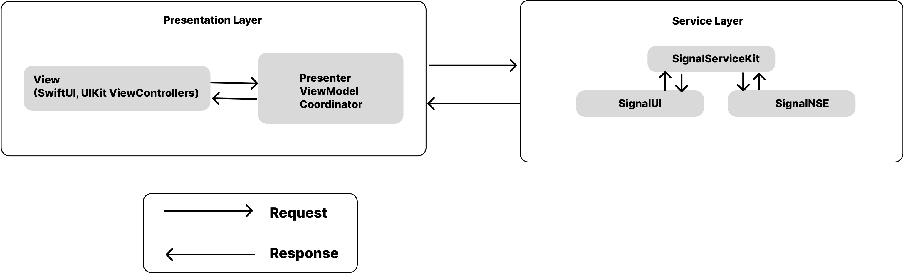
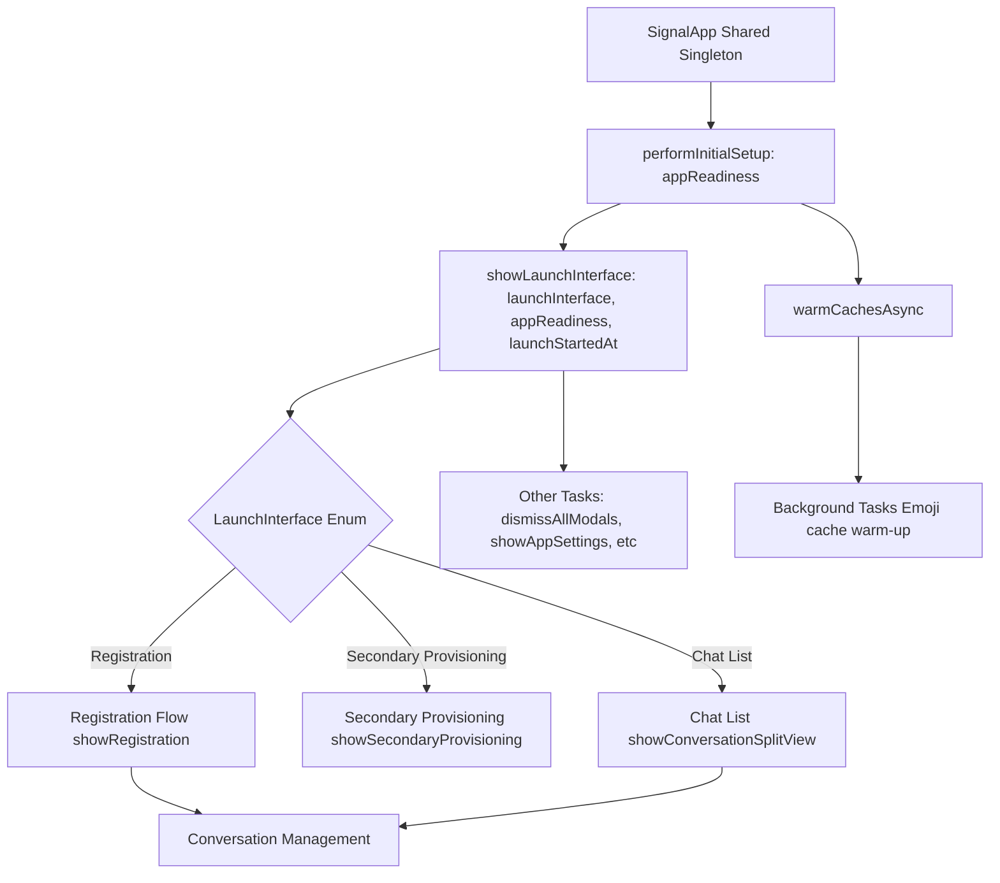

# Signal-iOS


## Introduction
[Signal](https://github.com/signalapp/Signal-iOS/tree/main) is a free, open source, messaging app for simple private communication with friends.


## Requirements

- Xcode 15 or highier
- iOS 15 or highier

## Installation

- Signal makes use of sub-modules, we must use git clone:

`git clone --recurse-submodules https://github.com/signalapp/Signal-iOS`

- Mode to the `Signal-iOS` folder and run:

`make dependencies`
- While running above command, you might face error like this:
`'urllib.error.URLError: <urlopen error [SSL: CERTIFICATE_VERIFY_FAILED]` . To solve it you need to follow [this answer](https://stackoverflow.com/a/70495761/4245112).


- Open the `Signal.xcworkspace` in Xcode.
- You can run `Signal` or `Signal-Staging` in the simulator.

## Application Architecture

### Folder Structure
- From the folder structure, we can see that the Signal iOS app is organized based on features and functionalities. Each folder corresponds either to a user-facing feature, such as the registration process, or to internal functionalities, like managing app launch operations. A detailed folder structure is provided below.

- Inside each feature folder, we find feature-related logic classes alongside a `UserInterface` subfolder, which contains all the views (Views) and controllers (ViewControllers).

- For example, let’s examine the Registration folder:
	- The Registration folder contains code for user onboarding, phone number verification, and account creation in Signal. It includes logic for validating phone numbers, managing registration states, and handling UI screens for the registration process.
	- Files like `RegistrationCoordinator.swift, RegistrationCoordinatorImpl.swift, RegistrationCoordinatorImpl+Service.swift, and RegistrationCoordinatorLoader.swift` contain navigation logic and manage the overall registration flow.
	- A file like PhoneNumberValidator.swift contains validation logic for phone numbers.
	- The UserInterface subfolder contains all view-related files.
	- There are specific view controller classes, such as `RegistrationRestoreFromBackupViewController.swift` `RegistrationChangePhoneNumberViewController.swift`, `RegistrationVerificationViewController.swift`, which handle UI interactions for functionalities like changing a phone number during registration, restoring an account from a backup or processing registration verification code.
	- ViewControllers most of the time contains a `State struct` that holds the state of the view and a `protocol Presenter`, that contains presentation logic. For example in the file `RegistrationVerificationViewController.swift` you will find `RegistrationVerificationPresenter` and `RegistrationVerificationState`.

```
├── AppLaunch
│   ├── AppDelegate.swift
│   ├── AppEnvironment.swift
│   ├── LaunchJobs.swift
│   ├── LoadingViewController.swift
│   ├── MainAppContext.swift
│   └── SignalApp.swift
├── Registration
│   ├── PhoneNumberValidator.swift
│   ├── RegistrationCoodinatorShims.swift
│   ├── RegistrationCoordinator.swift
│   ├── RegistrationCoordinatorDependencies.swift
│   ├── RegistrationCoordinatorImpl+Service.swift
│   ├── RegistrationCoordinatorImpl.swift
│   ├── RegistrationCoordinatorLoader.swift
│   ├── RegistrationMode.swift
│   ├── RegistrationStep.swift
│   ├── RegistrationUtils.swift
│   └── UserInterface
│       ├── RegistrationCaptchaViewController.swift
│       ├── RegistrationChangeNumberSplashViewController.swift
│       ├── RegistrationChangePhoneNumberConfirmationViewController.swift
│       ├── RegistrationChangePhoneNumberViewController.swift
│       ├── RegistrationConfirmModeSwitchViewController.swift
│       ├── RegistrationEnterBackupKeyViewController.swift
│       ├── RegistrationLoadingViewController.swift
│       ├── RegistrationNavigationController.swift
│       ├── RegistrationPermissionsView.swift
```
- Details of folder structure is [HERE](signal_res/signal_folder_structure.txt)


### App Architecture


- In this Diagram `Request` means request for Data, Service or UI and `Response` may contain Data, Service or UI.

#### Presentation layer
- Presentation layer contains Views and business logics. Views contains ViewControllers, UIViews, SwiftUI views. This layer also contains Presenters, ViewModels, Coordinators.
- This module mostly follows Model-View-Presenter (MVP) architecture, for example: `RegistrationVerificationViewController` acted as a `View` and there are `RegistrationVerificationPresenter` played as `Presenter` while `RegistrationVerificationState` and  `RegistrationVerificationValidationError` acted as `Model`.
- Delegation(Protocol-Delegate) is used to maintain communication among the components. For example:
	- `RegistrationVerificationViewController` contains presenter as a weak variable.

`private weak var presenter: RegistrationVerificationPresenter?`

	
- Functionalities of `RegistrationVerificationPresenter` is implemented inside `RegistrationNavigationController` which also initiates the `RegistrationVerificationViewController` with state and presenter.
- `RegistrationNavigationController` also contains coordintor through protocol `RegistrationCoordinator` and maintain navigation flow for registration. Implementation of `RegistrationCoordinator` is done in `RegistrationCoordinatorImpl`.

- A demo class diagram with minimal code:


#### Singleton Instance: SignalApp

The SignalApp class is a central orchestrator in the Signal iOS app, managing app initialization, navigation, and high-level state transitions. It follows best practices like the singleton pattern, dependency injection, and modular design to ensure a clean and maintainable architecture. Its responsibilities range from handling app launch to managing conversations and resetting app data, making it a critical component of the Signal app. The class is designed to serve as a bridge between the app’s core services (like the database and caching systems) and the UI. Though it is a Singleton class still it is using Dependency Injection through methods like `performInitialSetup(appReadiness:)` It encapsulates:

- Navigation and view management (launching the appropriate view controller based on user state).
- Background preparation (warming caches and setting up UI readiness).
- Maintenance tasks (resetting data, database integrity checks, exporting data)

#### Class Diagram of SignalApp.shared


##### Components
- SignalApp: The central singleton class that manages app-wide behavior. Interacts with other components like ConversationSplitViewController, RegistrationCoordinator, and SSKEnvironment.

- LaunchInterface: An enumeration that defines the possible launch states of the app (e.g., registration, chat list).

- ConversationSplitViewController: Manages the main chat interface, including displaying threads and conversations.

- RegistrationCoordinatorLoader and RegistrationCoordinator: Handle the registration flow for new or re-registering users.

- AppReadiness and AppReadinessSetter: Ensure the app is ready before performing certain actions.

- SSKEnvironment: Provides access to shared app components like the database, preferences, and notification presenter.

- SpamCaptchaViewController: Handles spam challenges by presenting a captcha to the user.

- TSThread and SignalServiceAddress: Represent chat threads and user addresses, respectively.

- OWSFileSystem and DebugLogger: Handle file system operations and debug logging.

#### Simplified Flow Diagram of SignalApp.shared




### Dependency Injection
- No 3rd party library is used to maintain dependency, it is fully managed manually. For example: in `AppDelegate` they initiate `DataBase` like this:

```
let databaseStorage: SDSDatabaseStorage
do {
    databaseStorage = try SDSDatabaseStorage(
        appReadiness: appReadiness,
        databaseFileUrl: SDSDatabaseStorage.grdbDatabaseFileUrl,
        keychainStorage: keychainStorage
    )
} catch KeychainError.notAllowed where application.applicationState == .background {
    notifyThatPhoneMustBeUnlocked()
} catch {
    // It's so corrupt that we can't even try to repair it.
    didAppLaunchFail = true
    Logger.error("Couldn't launch with broken database: \(error.grdbErrorForLogging)")
    let viewController = terminalErrorViewController()
    _ = initializeWindow(mainAppContext: mainAppContext, rootViewController: viewController)
    presentDatabaseUnrecoverablyCorruptedError(from: viewController, action: .submitDebugLogsAndCrash)
    return true
}
```


