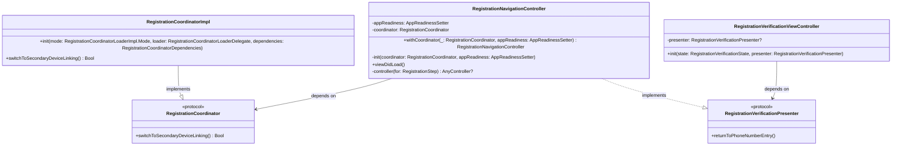
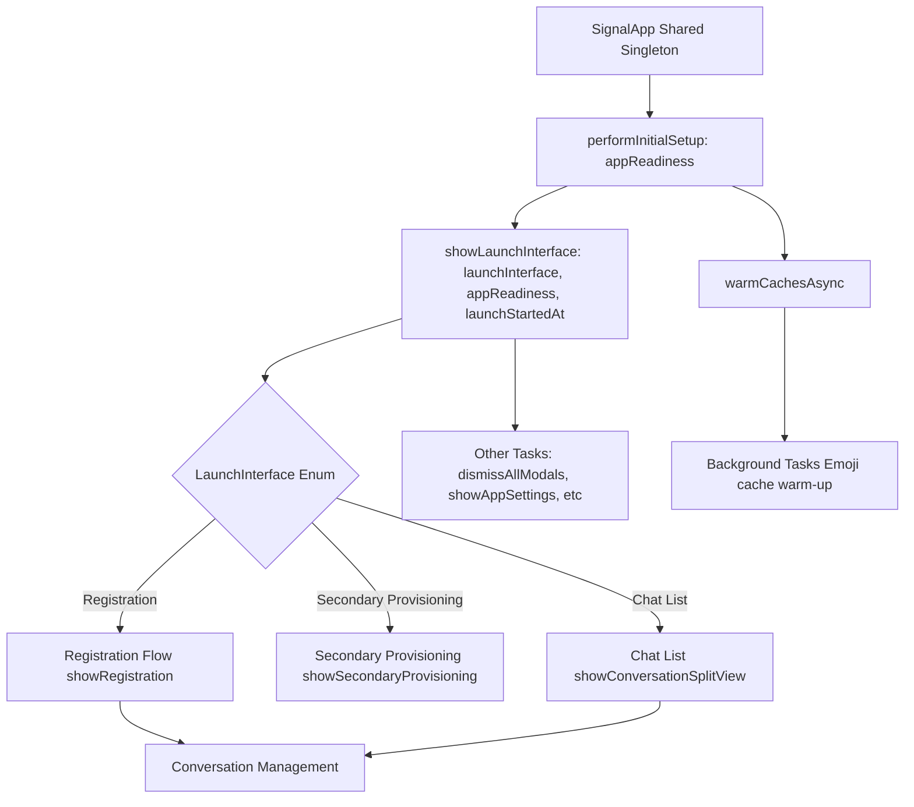
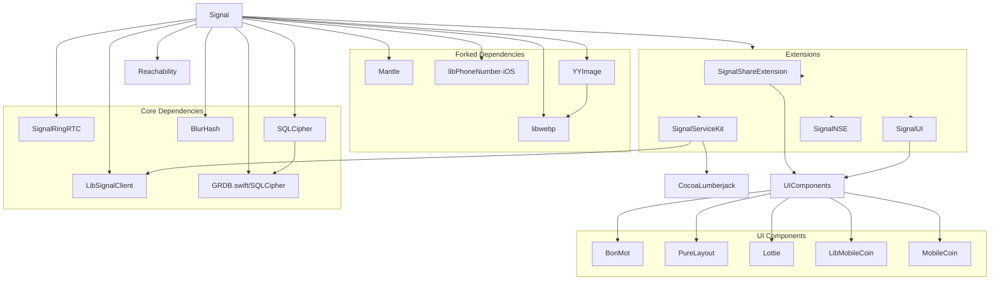
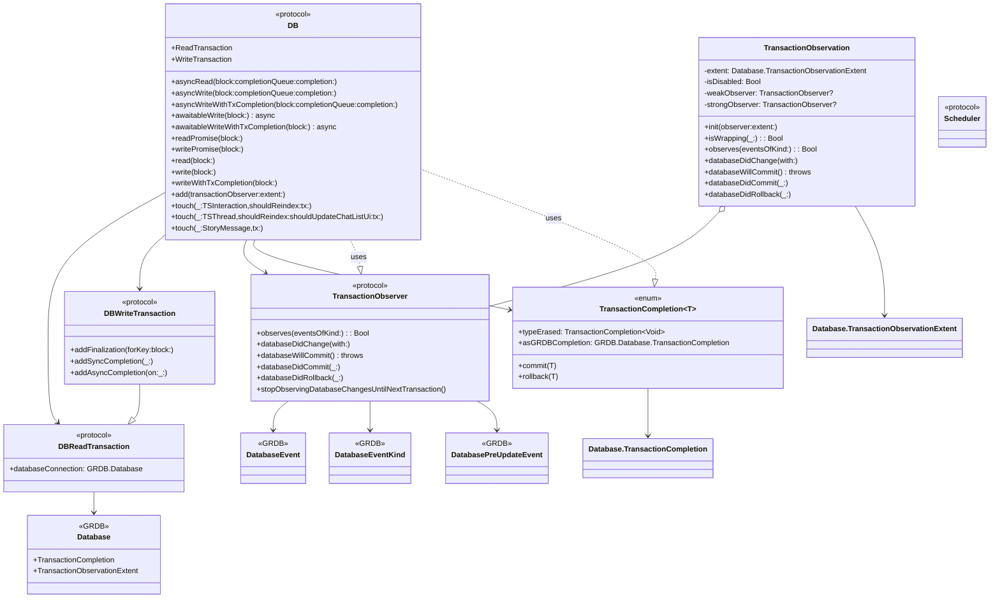
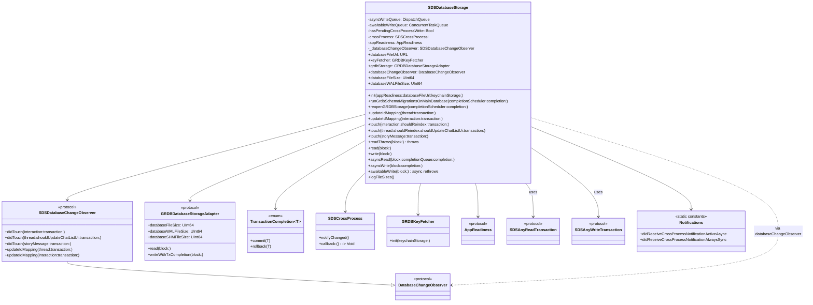

# Signal-iOS


## Introduction
[Signal](https://github.com/signalapp/Signal-iOS/tree/main) is a free, open source, messaging app for simple private communication with friends.


## Requirements

- Xcode 15 or highier
- iOS 15 or highier

## Installation

- Signal makes use of sub-modules, we must use git clone:

`git clone --recurse-submodules https://github.com/signalapp/Signal-iOS`

- Mode to the `Signal-iOS` folder and run:

`make dependencies`
- While running above command, you might face error like this:
`'urllib.error.URLError: <urlopen error [SSL: CERTIFICATE_VERIFY_FAILED]` . To solve it you need to follow [this answer](https://stackoverflow.com/a/70495761/4245112).


- Open the `Signal.xcworkspace` in Xcode.
- You can run `Signal` or `Signal-Staging` in the simulator.

## Application Architecture

### Folder Structure
- From the folder structure, we can see that the Signal iOS app is organized based on features and functionalities. Each folder corresponds either to a user-facing feature, such as the registration process, or to internal functionalities, like managing app launch operations. A detailed folder structure is provided below.

- Inside each feature folder, we find feature-related logic classes alongside a `UserInterface` subfolder, which contains all the views (Views) and controllers (ViewControllers).

- For example, let’s examine the Registration folder:
	- The Registration folder contains code for user onboarding, phone number verification, and account creation in Signal. It includes logic for validating phone numbers, managing registration states, and handling UI screens for the registration process.
	- Files like `RegistrationCoordinator.swift, RegistrationCoordinatorImpl.swift, RegistrationCoordinatorImpl+Service.swift, and RegistrationCoordinatorLoader.swift` contain navigation logic and manage the overall registration flow.
	- A file like PhoneNumberValidator.swift contains validation logic for phone numbers.
	- The UserInterface subfolder contains all view-related files.
	- There are specific view controller classes, such as `RegistrationRestoreFromBackupViewController.swift` `RegistrationChangePhoneNumberViewController.swift`, `RegistrationVerificationViewController.swift`, which handle UI interactions for functionalities like changing a phone number during registration, restoring an account from a backup or processing registration verification code.
	- ViewControllers most of the time contains a `State struct` that holds the state of the view and a `protocol Presenter`, that contains presentation logic. For example in the file `RegistrationVerificationViewController.swift` you will find `RegistrationVerificationPresenter` and `RegistrationVerificationState`.

```
├── AppLaunch
│   ├── AppDelegate.swift
│   ├── AppEnvironment.swift
│   ├── LaunchJobs.swift
│   ├── LoadingViewController.swift
│   ├── MainAppContext.swift
│   └── SignalApp.swift
├── Registration
│   ├── PhoneNumberValidator.swift
│   ├── RegistrationCoodinatorShims.swift
│   ├── RegistrationCoordinator.swift
│   ├── RegistrationCoordinatorDependencies.swift
│   ├── RegistrationCoordinatorImpl+Service.swift
│   ├── RegistrationCoordinatorImpl.swift
│   ├── RegistrationCoordinatorLoader.swift
│   ├── RegistrationMode.swift
│   ├── RegistrationStep.swift
│   ├── RegistrationUtils.swift
│   └── UserInterface
│       ├── RegistrationCaptchaViewController.swift
│       ├── RegistrationChangeNumberSplashViewController.swift
│       ├── RegistrationChangePhoneNumberConfirmationViewController.swift
│       ├── RegistrationChangePhoneNumberViewController.swift
│       ├── RegistrationConfirmModeSwitchViewController.swift
│       ├── RegistrationEnterBackupKeyViewController.swift
│       ├── RegistrationLoadingViewController.swift
│       ├── RegistrationNavigationController.swift
│       ├── RegistrationPermissionsView.swift
```
- Details of folder structure is [HERE](signal_res/signal_folder_structure.txt)


### App Architecture


- In this Diagram `Request` means request for Data, Service or UI and `Response` may contain Data, Service or UI.

#### Presentation layer
- Presentation layer contains Views and business logics. Views contains ViewControllers, UIViews, SwiftUI views. This layer also contains Presenters, ViewModels, Coordinators.
- This module mostly follows Model-View-Presenter (MVP) architecture, for example: `RegistrationVerificationViewController` acted as a `View` and there are `RegistrationVerificationPresenter` played as `Presenter` while `RegistrationVerificationState` and  `RegistrationVerificationValidationError` acted as `Model`.
- Delegation(Protocol-Delegate) is used to maintain communication among the components. For example:
	- `RegistrationVerificationViewController` contains presenter as a weak variable.

`private weak var presenter: RegistrationVerificationPresenter?`

	
- Functionalities of `RegistrationVerificationPresenter` is implemented inside `RegistrationNavigationController` which also initiates the `RegistrationVerificationViewController` with state and presenter.
- `RegistrationNavigationController` also contains coordintor through protocol `RegistrationCoordinator` and maintain navigation flow for registration. Implementation of `RegistrationCoordinator` is done in `RegistrationCoordinatorImpl`.

- A demo class diagram with minimal code:


#### Singleton Instance: SignalApp

The SignalApp class is a central orchestrator in the Signal iOS app, managing app initialization, navigation, and high-level state transitions. It follows best practices like the singleton pattern, dependency injection, and modular design to ensure a clean and maintainable architecture. Its responsibilities range from handling app launch to managing conversations and resetting app data, making it a critical component of the Signal app. The class is designed to serve as a bridge between the app’s core services (like the database and caching systems) and the UI. Though it is a Singleton class still it is using Dependency Injection through methods like `performInitialSetup(appReadiness:)` It encapsulates:

- Navigation and view management (launching the appropriate view controller based on user state).
- Background preparation (warming caches and setting up UI readiness).
- Maintenance tasks (resetting data, database integrity checks, exporting data)

#### Class Diagram of SignalApp.shared


##### Components
- SignalApp: The central singleton class that manages app-wide behavior. Interacts with other components like ConversationSplitViewController, RegistrationCoordinator, and SSKEnvironment.

- LaunchInterface: An enumeration that defines the possible launch states of the app (e.g., registration, chat list).

- ConversationSplitViewController: Manages the main chat interface, including displaying threads and conversations.

- RegistrationCoordinatorLoader and RegistrationCoordinator: Handle the registration flow for new or re-registering users.

- AppReadiness and AppReadinessSetter: Ensure the app is ready before performing certain actions.

- SSKEnvironment: Provides access to shared app components like the database, preferences, and notification presenter.

- SpamCaptchaViewController: Handles spam challenges by presenting a captcha to the user.

- TSThread and SignalServiceAddress: Represent chat threads and user addresses, respectively.

- OWSFileSystem and DebugLogger: Handle file system operations and debug logging.

#### Simplified Flow Diagram of SignalApp.shared




### Dependency Injection
- No 3rd party library is used to maintain dependency, it is fully managed manually. For example: in `AppDelegate` they initiate `DataBase` like this:

```
let databaseStorage: SDSDatabaseStorage
do {
    databaseStorage = try SDSDatabaseStorage(
        appReadiness: appReadiness,
        databaseFileUrl: SDSDatabaseStorage.grdbDatabaseFileUrl,
        keychainStorage: keychainStorage
    )
} catch KeychainError.notAllowed where application.applicationState == .background {
    notifyThatPhoneMustBeUnlocked()
} catch {
    // It's so corrupt that we can't even try to repair it.
    didAppLaunchFail = true
    Logger.error("Couldn't launch with broken database: \(error.grdbErrorForLogging)")
    let viewController = terminalErrorViewController()
    _ = initializeWindow(mainAppContext: mainAppContext, rootViewController: viewController)
    presentDatabaseUnrecoverablyCorruptedError(from: viewController, action: .submitDebugLogsAndCrash)
    return true
}
```


- Most of the ViewControllers having method like `public static func load()` that is used to create an instance of the ViewController from outside. For example: 
- `ConversationViewController` has a static load() method that takes some parameters and return the VC:

```
public static func load(
    appReadiness: AppReadinessSetter,
    threadViewModel: ThreadViewModel,
    action: ConversationViewAction,
    focusMessageId: String?,
    tx: SDSAnyReadTransaction
) -> ConversationViewController {
    let thread = threadViewModel.threadRecord
    
    // CODES FOR CREATING OTHER ITEMS

    let cvc = ConversationViewController(
        appReadiness: appReadiness,
        threadViewModel: threadViewModel,
        conversationViewModel: conversationViewModel,
        action: action,
        conversationStyle: conversationStyle,
        didAlreadyShowGroupCallTooltipEnoughTimes: didAlreadyShowGroupCallTooltipEnoughTimes,
        loadAroundMessageId: loadAroundMessageId,
        scrollToMessageId: scrollToMessageId,
        oldestUnreadMessage: oldestUnreadMessage,
        chatColor: chatColor,
        wallpaperViewBuilder: wallpaperViewBuilder
    )

    return cvc
}


```

- This loader is called from another class like this:
```
func createPreviewController(atIndexPath indexPath: IndexPath) -> UIViewController? {
    guard let threadViewModel = tableDataSource.threadViewModel(forIndexPath: indexPath) else {
        owsFailDebug("Missing threadViewModel.")
        return nil
    }
    let vc = SSKEnvironment.shared.databaseStorageRef.read { tx in
        ConversationViewController.load(
            appReadiness: appReadiness,
            threadViewModel: threadViewModel,
            action: .none,
            focusMessageId: nil,
            tx: tx
        )
    }
    vc.previewSetup()
    return vc
}


```

### Dependency List

- For managing dependency Signal iOS is using Cocoapods.
- Most dependencies use explicit version tags (e.g., SwiftProtobuf 1.28.2)

#### Important Signal Dependencies
##### LibSignalClient
- The fundamental encryption library from Signal contains platform-agnostic APIs used by the official Signal clients and servers, exposed as a Java, Swift, or TypeScript library. It ensures that only the sender and intended recipient(s) can read messages—not even Signal’s servers can decrypt them.
- libsignal-protocol implements the Signal protocol, including the Double Ratchet algorithm. A replacement for libsignal-protocol-java and libsignal-metadata-java.
- Support logic for Signal's device-to-device transfer feature.

##### SignalRingRTC
- SignalRingRTC is a middleware library providing Signal Messenger applications with video and voice calling services built on top of WebRTC.


##### SQLCipher
- SQLCipher is an open-source extension of SQLite that adds transparent, full-database encryption
- It ensures all data written to disk is AES-256 encrypted, protecting user messages, contacts, and metadata if the device is compromised.



### Service layer

#### Data Management

- Signal iOS is using a 3rd party library named [GRDB](https://github.com/groue/GRDB.swift) which is a toolkit for SQLite databases, with a focus on application development to store data.
- They used UserDefaults too.

#### DB protocol
- The DB protocol defines an abstraction layer for database operations and transactions, providing a unified interface that mimics the behavior of the underlying storage mechanism.

- By defining a protocol that wraps transaction-based operations, the design allows high-level components to remain agnostic about how the data is persisted. Tests can replace the actual database implementation with stubs, ensuring that business logic can be validated without side effects caused by interacting with a real database.


- The protocol separates the mechanics of executing SQL queries from the higher-level model and query classes (like the “FooFinder” or models conforming to SDSCodableModel). This way, the actual query implementation is delegated to lower-level helpers, while the rest of the system relies on the abstract transaction interface.

- `SDSDB` conforms this protocol and use `SDSDatabaseStorage` to manage database related functionality.
- In `AppDelegate` inside inside `didFinishLauncWithOption`, `SDSDatabaseStorage` is created like this:

```
let databaseStorage: SDSDatabaseStorage
do {
    databaseStorage = try SDSDatabaseStorage(
        appReadiness: appReadiness,
        databaseFileUrl: SDSDatabaseStorage.grdbDatabaseFileUrl,
        keychainStorage: keychainStorage
    )
} catch KeychainError.notAllowed where application.applicationState == .background {
    notifyThatPhoneMustBeUnlocked()
}
```
- Then `SDSDB` is created like this:

`let db = SDSDB(databaseStorage: databaseStorage`

- For testing `InMemoryDB` implements DB protocol.
- Its main purposes are to decouple the higher-level business logic from the specifics of SQL queries and to facilitate stubbing or testing of database interactions without performing real SQL operations.

- Main features of DB:

	- Transaction Types:

		- ReadTransaction for read operations

		- WriteTransaction for write operations

	- Async Methods:

		- asyncRead/asyncWrite: Perform operations asynchronously with completion handlers

		- asyncWriteWithTxCompletion: Write with transaction completion handling

	- Awaitable Methods (for async/await):

		- awaitableWrite/awaitableWriteWithTxCompletion: Write operations that can be awaited

	- Promise-based Methods:

		- readPromise/writePromise: Return Promises for the operations

	- Synchronous Methods:

		- read/write: Perform operations synchronously

	- writeWithTxCompletion: Synchronous write with transaction completion

	- Observation:

		- add(transactionObserver:): Add observers for database transactions

	- Touching (marking objects as modified):

		- Methods for TSInteraction, TSThread, and StoryMessage to update their timestamps and trigger reindexing/UI updates

	- Convenience:

		- Default parameters for file, function, and line (using #file, #function, #line)

		- Overloads with simplified parameters (e.g., default shouldUpdateChatListUi for thread touching)



#### SDSDatabaseStorage

- `SDSDatabaseStorage` is the primary database access layer for Signal, providing thread-safe read/write operations to SQLite via GRDB (GRDB.swift). It handles all database interactions including schema migrations, cross-process notifications, and change observation.
- Wraps GRDB (SQLite) operations while providing a cleaner interface

- Enforces proper threading patterns (main thread checks, background queue usage)

- Designed for both Swift and Objective-C interoperability

- Implements multiple async patterns (completion handlers, async/await, Promises)

- Handles database corruption scenarios gracefully



`runGrdbSchemaMigrationsOnMainDatabase(completionScheduler:completion:)`
- Runs any pending schema migrations for the main database using GRDBSchemaMigrator.
- If migrations occur, it reopens the GRDB database to avoid stale connections.
- Ensures the database is in sync with the app’s expected schema before use.
- Executes the completion block on the provided completionScheduler.


`reopenGRDBStorage(completionScheduler:completion:)`
Recreates the internal GRDBDatabaseStorageAdapter, which:

- Releases old database connections (to avoid stale readers/writers after migrations).
- Re-initializes grdbStorage using the original config.
- Invokes the completion block on the specified scheduler once done.

`updateIdMapping(thread:transaction:)`
- Updates the internal ID mapping for a TSThread inside the DatabaseChangeObserver.

- Used to track and sync internal references to that thread during a write transaction.

`updateIdMapping(interaction:transaction:)`
- Same as above, but for a TSInteraction (e.g. messages).

- Ensures consistent ID tracking for message interactions in storage and UI updates.

`touch(interaction:shouldReindex:transaction:)`
- Marks a TSInteraction as accessed/modified:

- Notifies the change observer (didTouch)

- Optionally triggers full-text reindexing if shouldReindex is true.

`touch(thread:shouldReindex:shouldUpdateChatListUi:transaction:)`
Marks a TSThread as modified:
- Updates the change observer (with option to update chat list UI).
- Reindexes the thread using the searchableNameIndexer if shouldReindex is true.

`touch(storyMessage:transaction:)`
- Signals that a StoryMessage was accessed or modified:
- Notifies the DatabaseChangeObserver for this specific type of entity.

`readThrows(block:) throws`
- Performs a synchronous read operation:
- Executes a block using a SDSAnyReadTransaction.
- Propagates any thrown errors to the caller.

`read(block:)`
- Same as readThrows, but:
- Catches errors internally.
- Flags database corruption if an error occurs, instead of throwing it.

`write(block:)`
Performs a synchronous write transaction:

- Executes the provided block with a SDSAnyWriteTransaction.
- Auto-commits the transaction at the end.
- Catches and logs any thrown errors (instead of rethrowing).

`asyncRead(block:completionQueue:completion:)`
Runs a read block on a background thread:

- Executes the block with a SDSAnyReadTransaction.
- Optionally delivers the result to completion on completionQueue.

`asyncWrite(block:completion:)`
Runs a write operation asynchronously using a background queue:

- Accepts a block using SDSAnyWriteTransaction.
- Auto-commits after execution.
- Optionally delivers result via completion.

`awaitableWrite(block:) async rethrows`
Executes a write operation using Swift's async/await:

- Ensures serialized execution via ConcurrentTaskQueue.
- Supports throwing operations.
- Auto-commits the transaction.


