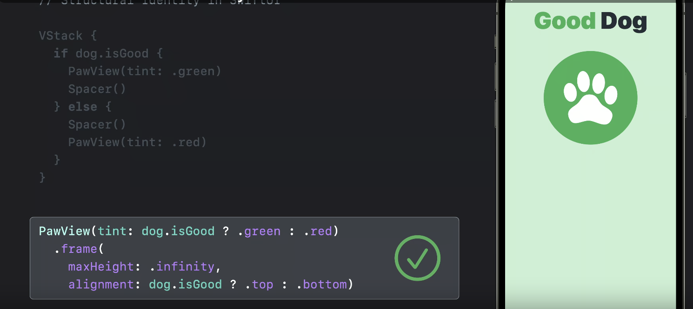
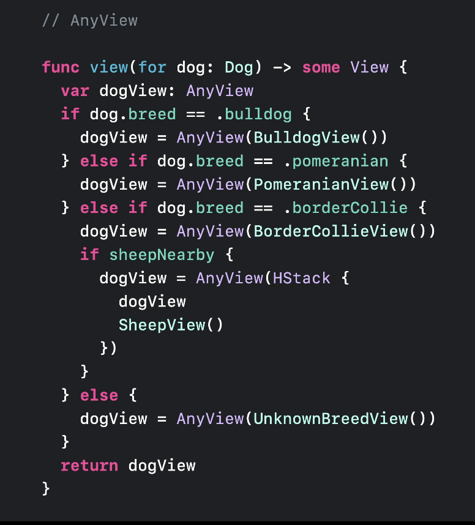
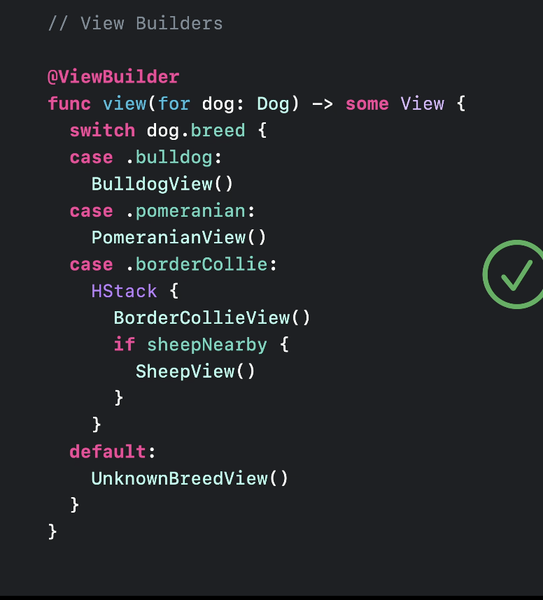

# Demystify SwiftUI

### When SwiftUI looks at your code, what does it see? 

- Three things: identity, lifetime, and dependencies.
- Identity is how SwiftUI recognizes elements as the same or distinct across multiple updates of your app.
- Lifetime is how SwiftUI tracks the existence of views and data over time.
- And dependencies are how SwiftUI understands when your interface needs to be updated and why.

### Identity
- 2 types: Explicit, Implicit

## Explicit

- Set id to a view
```
SomeView()
    .id(ViewId)
```

- Use that id

```
scrollViewProxy.scrollTo(ViewId, anchor: .topLeading)
```

## Implicit(Structural identity)
- SwiftUI uses the structure of your view hierarchy to generate implicit identities for your views so you don't have to.
- Structural identity distinguishing views by their type and position in the view hierarchy.


### Best way of writing code for conditional views

- Rather than using below pattern we can use the way showed in the image as much as possible

```
// Avoidable pattern

if condition {
   view 1
} else {
   view 2
}
```

```
// Best pattern

SomeView(condition ? property_1 : property_2)
```




### AnyView , ViewBuilder

- Avoid using `AnyView` and use `ViewBuilder` for conditional views. Because:
    
	- `AnyView` erase type information from code, which makes it difficult to manage structural identity
	- `AnyView` hides static type information from the compiler, it can sometimes prevent helpful diagnostic errors and warnings from being surfaced in your code.

- Finally, keep in mind that using AnyView when you don't need to can result in worse performance. When possible, use generics to preserve static type information rather than passing AnyViews around your code.


| Bad code  | Good code |
| ------------- | ------------- |
|  |   |


## Resources

- https://developer.apple.com/videos/play/wwdc2021/10022/
- https://developer.apple.com/videos/play/wwdc2019/216/


