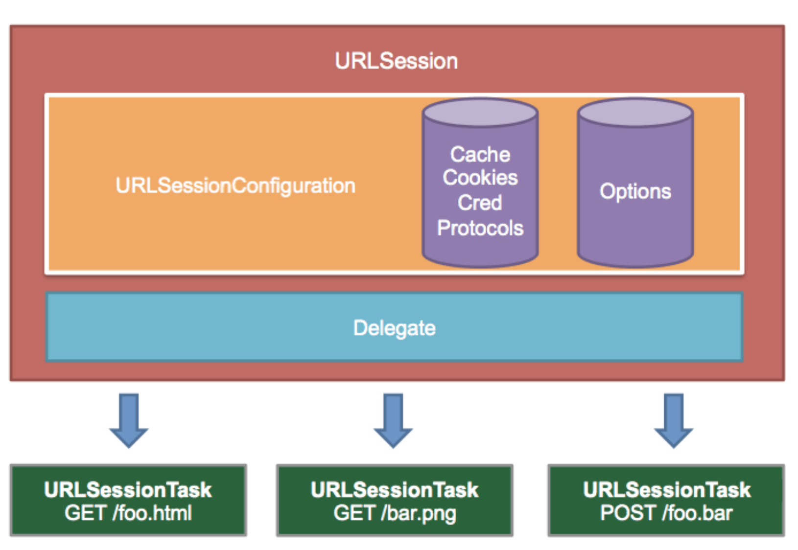
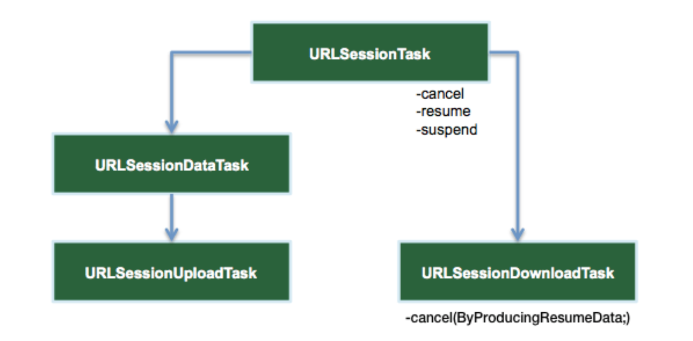

# [URLSession](https://www.raywenderlich.com/3244963-urlsession-tutorial-getting-started)
URLSession is both a class and a suite of classes for handling HTTP- and HTTPS-based requests.
URLSession is the key object responsible for sending and receiving requests. You create it via URLSessionConfiguration, which comes in three flavors:

- **default**: Creates a default configuration object that uses the disk-persisted global cache, credential and cookie storage objects.
- **ephemeral**: Similar to the default configuration, except that you store all of the session-related data in memory. Think of this as a “private” session.
- **background**: Lets the session perform upload or download tasks in the background. Transfers continue even when the app itself is suspended or terminated by the system.




## URLSessionConfiguration
URLSessionConfiguration lets you configure session properties such as timeout values, caching policies and HTTP headers. Refer to Apple’s documentation for a full list of configuration options.

## URLSessionTask
URLSessionTask is an abstract class that denotes a task object. A session creates one or more tasks to do the actual work of fetching data and downloading or uploading files.
There are three types of concrete session tasks:

- **URLSessionDataTask**: Use this task for GET requests to retrieve data from servers to memory.
- **URLSessionUploadTask**: Use this task to upload a file from disk to a web service via a POST or PUT method.
- **URLSessionDownloadTask**: Use this task to download a file from a remote service to a temporary file location.




# Alamofire
There are several major functions available with Alamofire:

- Alamofire.upload: Upload files with multipart, stream, file or data methods.
- Alamofire.download: Download files or resume a download already in progress.
- Alamofire.request: Every other HTTP request not associated with file transfers.

These Alamofire methods are global within Alamofire so you don’t have to instantiate a class to use them. There are underlying pieces to Alamofire that are classes and structs, like SessionManager, DataRequest, and DataResponse; however, you don’t need to fully understand the entire structure of Alamofire to start using it.

## URLRequestConvertible
Alamofire provides a simple method to eliminate this code duplication and provide centralized configuration. The technique involves creating a struct conforming to URLRequestConvertible and updating your upload and request calls.

```swift
import Alamofire

public enum ImaggaRouter: URLRequestConvertible {
  enum Constants {
    static let baseURLPath = "http://api.imagga.com/v1"
    static let authenticationToken = "Basic xxx" 
  }
  
  case content
  case tags(String)
  case colors(String)
  
  var method: HTTPMethod {
    switch self {
    case .content:
      return .post
    case .tags, .colors:
      return .get
    }
  }
  
  var path: String {
    switch self {
    case .content:
      return "/content"
    case .tags:
      return "/tagging"
    case .colors:
      return "/colors"
    }
  }
  
  var parameters: [String: Any] {
    switch self {
    case .tags(let contentID):
      return ["content": contentID]
    case .colors(let contentID):
      return ["content": contentID, "extract_object_colors": 0]
    default:
      return [:]
    }
  }
  
  public func asURLRequest() throws -> URLRequest {
    let url = try Constants.baseURLPath.asURL()
    
    var request = URLRequest(url: url.appendingPathComponent(path))
    request.httpMethod = method.rawValue
    request.setValue(Constants.authenticationToken, forHTTPHeaderField: "Authorization")
    request.timeoutInterval = TimeInterval(10 * 1000)
    
    return try URLEncoding.default.encode(request, with: parameters)
  }
}

```

## [Customizing Session](https://www.raywenderlich.com/11668143-alamofire-tutorial-for-ios-advanced-usage)

Alamofire provides Session, which is similar to URLSession in terms of responsibility. It helps create and manage different requests and provides common functionality for all requests, such as interception, response caching and more.

```swift
// create session
let sessionManager: Session = {
  let configuration = URLSessionConfiguration.af.default
  configuration.timeoutIntervalForRequest = 30
  configuration.waitsForConnectivity = true // makes the session wait for network connectivity before making the request
  return Session(configuration: configuration)
}()

// request using serrion
sessionManager.request(url, parameters: queryParameters)

```


