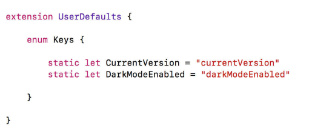
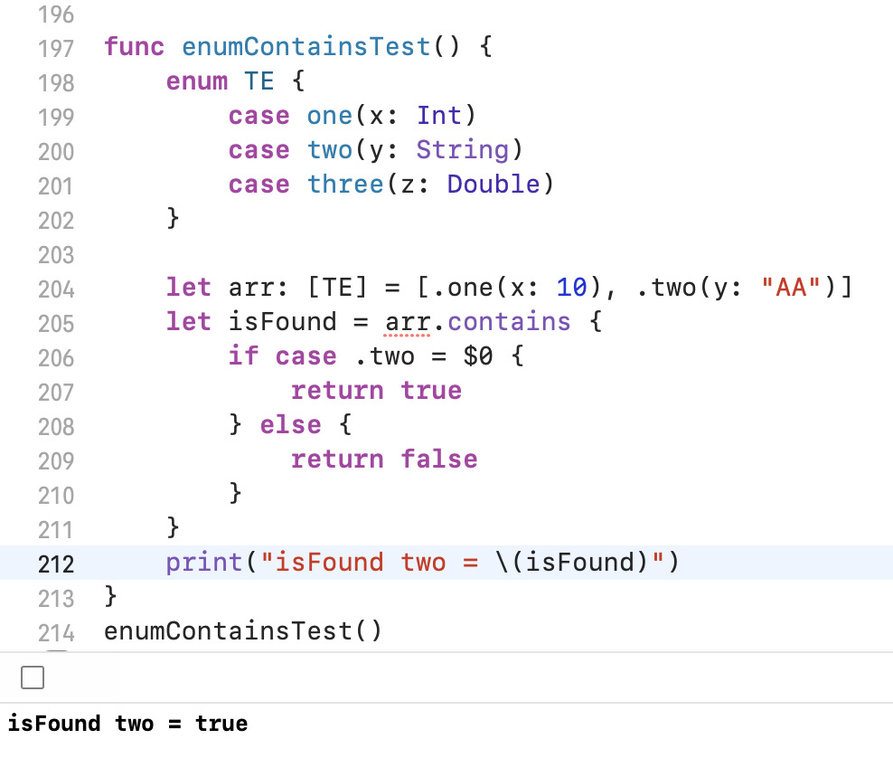

## Extend UerDefaults to keep the keys

## [Compare Enums with associated values](https://stackoverflow.com/a/66062597/4245112)

## ABI stability
### Swift is still moving fast and is not ABI-stable, which means that code written in Swift 4 will not be compatible with Swift 5, and vice versa. Imagine writing a framework for your application. As soon as Swift 5 comes out, an application written in Swift 5 can’t use your framework until you’ve updated your framework to Swift 5. Luckily, Xcode offers plenty of help to migrate, so I expect that this migration won’t be as painful.