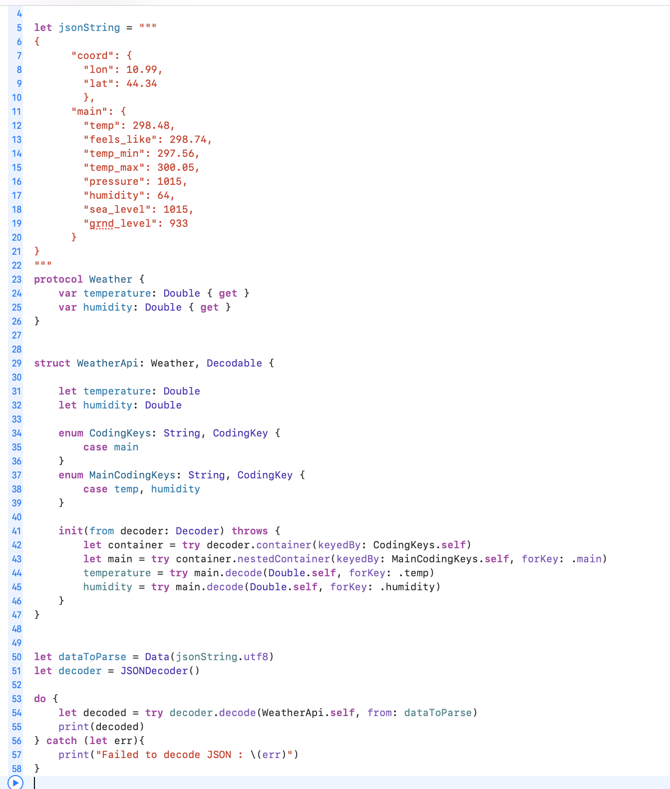

## Extend UserDefaults to keep the keys

## [Compare Enums with associated values](https://stackoverflow.com/a/66062597/4245112)

## ABI stability
### Swift is still moving fast and is not ABI-stable, which means that code written in Swift 4 will not be compatible with Swift 5, and vice versa. Imagine writing a framework for your application. As soon as Swift 5 comes out, an application written in Swift 5 can’t use your framework until you’ve updated your framework to Swift 5. Luckily, Xcode offers plenty of help to migrate, so I expect that this migration won’t be as painful.

## [JSON parsing with CodingKey](https://www.hackingwithswift.com/articles/119/codable-cheat-sheet)

## [isEmpty vs count == 0](https://www.swiftbysundell.com/articles/count-vs-isEmpty/)

- Using `isEmpty` and `count == 0` equivalent? Sometimes, yes (for example when working with a Set), but sometimes (like in the case of String), using count to determine whether a collection is empty is incredibly wasteful — given that the entire collection will be looped through, just so that we can then check if that count is equal to 0.

- Always use `isEmpty` when you want to check whether a collection is or isn’t empty. It reads better, is more self-explanatory, and is always super fast. Only use `count` when you’re interested in the actual number of elements in the collection.