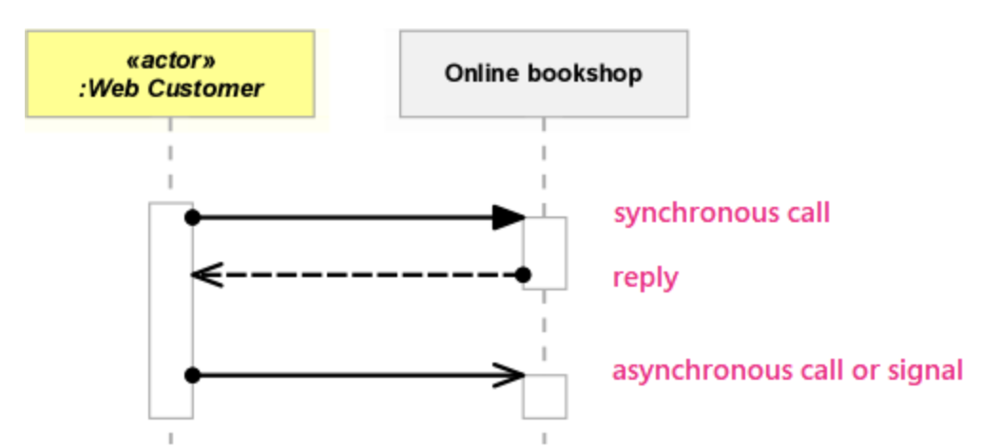
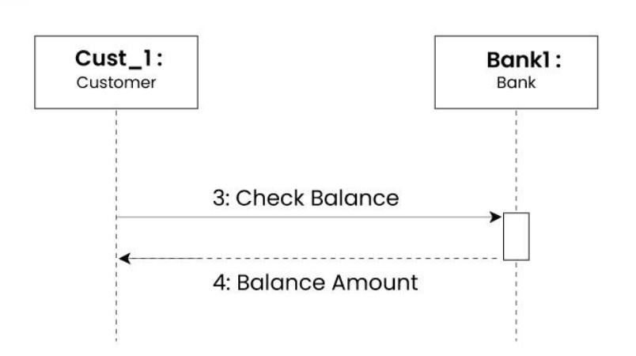
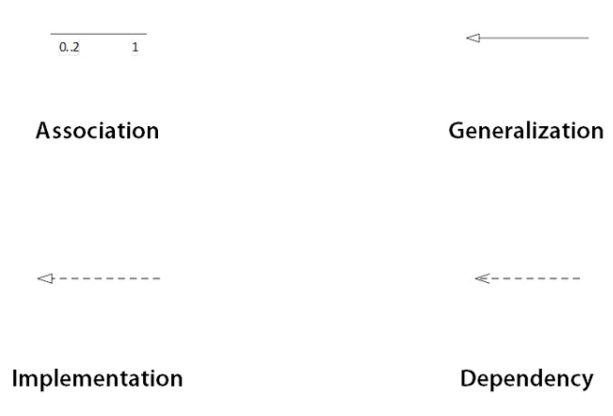

# UML

## Structural Modeling
- Related to things(concrete or concptual)
- Usually refer to Noun

### Structural Modeling Diagram Types

- Class
- Component(Plugable and Replaceble piece of Software)
- Package
- Deployment

## Behavioral Modeling
- Related to functionality
- Usually refer to Verb

### Behavioral Modeling Diagram Types

- Use Case
- Sequence
- State
- Activity

### Message types

- [Types](https://www.uml-diagrams.org/interaction-message.html)
- Need to write function names over the line

- Return message

### State
A state is a condition or situation during the life of an object during which it satisfies some condition, performs some activity, or waits for some event.

### Event
An event is the specification of a significant occurrence that has a location in time and space. In the context of state machines, an event is an occurrence of a stimulus that can trigger a state transition.

A guard condition is evaluated after the trigger event for the transition occurs. It is possible to have multiple transitions from the same source state and with the same event trigger, as long as the guard conditions don’t overlap. A guard condition is evaluated just once for the transition at the time the event occurs. The boolean expression may reference the state of the object.

### Transition
A transition is a relationship between two states indicating that an object in the first state will perform certain actions and enter the second state when a specified event occurs and specified conditions are satisfied. Activity is an ongoing non-atomic execution within a state machine.

### Action
An action is an executable atomic computation that results in a change in the state of the model or the return of a value.

### Relationships

#### Associations	
- Indicate that instances of one model element are connected to instances of another model element
- Example: 
	- 1..1: Only one
	- 0..*: Zero or more
	- 1..*:one or more
#### Dependencies	
- Indicate that a change to one model element can affect another model element
#### Generalizations	
- Indicate that one model element is a specialization of another model element
#### Realization / Implementation	
- Indicate that one model element provides a specification that another model element implements

### Class Diagram

The UML Class diagram is a graphical notation used to construct and visualize object oriented systems. A class diagram in the Unified Modeling Language (UML) is a type of static structure diagram that describes the structure of a system by showing the system's:

- classes,
- their attributes,
- operations (or methods),
- and the relationships among objects.

### When do we need Class Diagram

-  Class diagrams provide a visual representation of the structure of a system, showing the classes, attributes, operations, and relationships between them. This visual representation helps stakeholders understand the architecture and design of the system more easily.

- Class diagrams serve as a means of communication between different stakeholders such as developers, designers, testers, and business analysts. They provide a common language and visual representation that can be easily understood by everyone involved in the project.

- Class diagrams can reveal recurring patterns in the system design, such as inheritance, aggregation, association, and composition. Recognizing these patterns can lead to more efficient and reusable designs.

-  By visually representing the relationships and dependencies between classes, class diagrams can help in identifying potential errors or inconsistencies in the design early in the development process, before implementation begins.

- In the design phase, class diagrams are used to model the structural aspects of the system. They help in designing the class hierarchy, defining the attributes and methods of each class, and specifying the relationships between classes such as associations, aggregations, and inheritances.

- UML class diagrams serve as a means of communication between different stakeholders involved in the project, including developers, designers, testers, and business analysts. They provide a common visual language that can be easily understood by everyone, facilitating effective communication and collaboration.

- In some cases, class diagrams can be used to generate code automatically. Tools that support Model-Driven Development (MDD) can take UML diagrams, including class diagrams, and generate code in various programming languages, which can significantly speed up the development process.

### Main components of class diagram

- Class: Represents a template or blueprint for objects. It consists of a name, attributes, and operations/methods.

- Attributes: Describes the properties or characteristics of a class. Attributes are usually depicted as name: type pairs. For example, "name: String".

- Operations/Methods: Represents the behavior or actions that objects of the class can perform. Operations are usually depicted as name(parameters): return type. For example, "calculatePrice(quantity: int): double".

- Visibility: Denotes the visibility or access level of attributes and methods. Common visibility modifiers include public (+), private (-), protected (#), and package (~).

- Relationships:

	- Association: Represents a relationship between two classes, indicating that objects of one class are connected to objects of another class. Associations can have multiplicities (e.g., 1..*).
	- Aggregation: Denotes a "whole-part" relationship between classes, where one class (the whole) contains or is composed of instances of another class (the part). Aggregation is depicted using a diamond-shaped hollow arrowhead.
	- Composition: Similar to aggregation but with stronger ownership semantics. In composition, the part class is dependent on the whole class, and the part cannot exist without the whole. Composition is depicted using a solid diamond-shaped arrowhead.
	- Inheritance/Generalization: Represents an "is-a" relationship between classes, where one class (subclass or child) inherits attributes and operations from another class (superclass or parent). Inheritance is depicted using a solid line with a hollow arrowhead pointing from the subclass to the superclass.
	- Realization/Implementation: Denotes a relationship between a class and an interface or abstract class, indicating that the class implements the behavior specified by the interface or abstract class. Realization is depicted using a dashed line with a hollow arrowhead pointing from the implementing class to the interface or abstract class.
- Multiplicity: Represents the cardinality or number of instances participating in a relationship. Multiplicity is specified using numerical values or symbols such as "", "0..1", "1..", etc.

- Dependency: Denotes a relationship where one class depends on another class in some way. Dependencies can be depicted using dashed lines with an arrowhead pointing from the dependent class to the independent class.

- [Resources](https://www.visual-paradigm.com/guide/uml-unified-modeling-language/uml-class-diagram-tutorial/)

