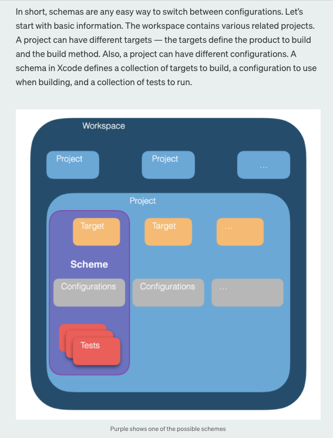

# iOSEssentials


### Below objective C code will show/ remove a loading screen over the view
``` objective C
-(void) showLoadingIndicator{

    loadingView = [[UIView alloc] initWithFrame:self.view.frame];
    loadingView.translatesAutoresizingMaskIntoConstraints = NO;
    spinner = [[UIActivityIndicatorView alloc] initWithActivityIndicatorStyle:UIActivityIndicatorViewStyleWhiteLarge];
    spinner.activityIndicatorViewStyle = UIActivityIndicatorViewStyleWhiteLarge;
    [spinner setCenter:CGPointMake(self.view.frame.size.width / 2,self.view.frame.size.height / 2)];
    [loadingView setBackgroundColor: [UIColor blackColor]];
    [loadingView setAlpha:0.5];
    [self.view setUserInteractionEnabled:NO];
    [spinner setAlpha:1.0];
    [loadingView addSubview:spinner];
    [spinner startAnimating];
    loadingView.translatesAutoresizingMaskIntoConstraints = false;
    [self.view addSubview: loadingView];
    
    [loadingView.leadingAnchor constraintEqualToAnchor:self.view.leadingAnchor].active = YES;
    [loadingView.trailingAnchor constraintEqualToAnchor:self.view.trailingAnchor].active = YES;
    [loadingView.topAnchor constraintEqualToAnchor:self.view.topAnchor].active = YES;
    [loadingView.bottomAnchor constraintEqualToAnchor:self.view.bottomAnchor].active = YES;
}

-(void) removeLoadingIndicator{
    [self.view setUserInteractionEnabled:YES];
    [self.view setAlpha:1.0];
    [spinner stopAnimating];
    [spinner removeFromSuperview];
    [loadingView removeFromSuperview];
}
```


### TableRoWHeight / estimatedRowHeight
Normally, a cell’s height is determined by the table view delegate’s tableView:heightForRowAtIndexPath:method. 
To enable self-sizing table view cells, you must set the table view’s rowHeight property to UITableViewAutomaticDimension. You must also assign a value to the estimatedRowHeight property. As soon as both of these properties are set, the system uses Auto Layout to calculate the row’s actual height.
* tableView.estimatedRowHeight = 85.0
* tableView.rowHeight = UITableViewAutomaticDimension


### UserDefault
Save data in userdefault:
``` Swift
UserDefaults.standard.set(IntegerData, forKey: "myIndex") // other datatypes can be saved also
// key must be unique for each userDefault
```
Then retrieve the data from any viewController:
``` Swift
If UserDefaults.standard.object(forKey: "myIndex"){
	let savedIndexPAth = UserDefaults.standard.integer(forKey: "myIndex")
}
```

### CollectionView Scroll Direction 
Change CollectionView Scroll Direction :
``` Swift
if let flowLayout = firstCollectionView.collectionViewLayout as? UICollectionViewFlowLayout {
       flowLayout.scrollDirection = .vertical // .horizontal
}
```

### semanticContentAttribute
semanticContentAttribute can force an Item alignment
``` Swift
Button.semanticContentAttribute = .forceLeftToRight
//this will force "Button" to LeftToRight in any situation like RTL also
```

### [content hugging and content compression resistance priorities](https://medium.com/@abhimuralidharan/ios-content-hugging-and-content-compression-resistance-priorities-476fb5828ef)

### [setNeedsLayout() layoutIfNeeded() layoutSubviews()](https://medium.com/@abhimuralidharan/ios-swift-setneedslayout-vs-layoutifneeded-vs-layoutsubviews-5a2b486da31c)

### [GCD vs NSOperation the two threading options in iOS](https://stackoverflow.com/questions/10373331/nsoperation-vs-grand-central-dispatch)

### iOS StatusBar theme Change:
``` Swift
override func viewWillAppear(_ animated: Bool) {
    super.viewWillAppear(animated)
    setNeedsStatusBarAppearanceUpdate()
}
override var preferredStatusBarStyle: UIStatusBarStyle {
    .lightContent
}
```

### What’s the difference between the frame and the bounds?
The bounds of a UIView is the rectangle, expressed as a location (x,y) and size (width, height) relative to its own coordinate system (0,0).
The frame of a UIView is the rectangle, expressed as a location (x,y) and size (width, height) relative to the superview it is contained within.

### Objective C Header Rule
https://developer.apple.com/documentation/swift/imported_c_and_objective-c_apis/importing_swift_into_objective-c

Include Swift Classes in Objective-C Headers Using Forward Declarations
When declarations in an Objective-C header file refer to a Swift class or protocol that comes from the same target, importing the generated header creates a cyclical reference. To avoid this, use a forward declaration of the Swift class or protocol to reference it in an Objective-C interface.
``` Objective-C
// MyObjcClass.h
@class MySwiftClass;
@protocol MySwiftProtocol;

@interface MyObjcClass : NSObject
- (MySwiftClass *)returnSwiftClassInstance;
- (id <MySwiftProtocol>)returnInstanceAdoptingSwiftProtocol;
// ...
@end
```	
#### Forward declarations of Swift classes and protocols can be used only as types for method and property declarations.

## Workspace Structure



## Localization of Texts

- [Working tutorial](https://lokalise.com/blog/getting-started-with-ios-localization/)
- [Example commit](https://github.com/nimblehq/ci-cd-sample-ios/pull/20/commits/38dd159f8cd4d4214c6b445cfc3dd63c7149d808#diff-a4cdc98fadcdbada231e5334dd597e524e8fd8f55833c5c1473862c0333c6a12)
